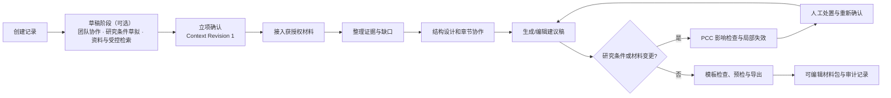

# 产品蓝图与范围

## 1. 产品目标

灵档以一个科研申报项目为工作单元，帮助课题组把获准使用的资料、正文、图表、模板和确认记录持续关联。它解决的不是单次生成，而是多轮修改后“来源、内容、图表和最终文件是否仍一致”的问题。

Beta 遵循“已有项目知识优先、外部学术来源补充”的顺序：项目关联的 ProjectAsset 和已确认 EvidenceCard 先用于检索与写作；只有任务明确允许且来源目录通过时，才调用外部学术来源。联网检索不在这条“写作依据”的序列里：它复用租户已配置的搜索能力，只作**发现层**使用，结果不直接成为正文依据（见第 3 节）。

首批用户是已经积累研究材料、需要多人参与并反复修订申报书的课题组。直接使用者包括负责人、教师/研究骨干、研究生与科研秘书；机构管理员只处理必要的配置、审计和支持。

## 2. 端到端用户闭环

关键体验是：用户能看到“哪些内容基于什么、这次修改影响了什么、还缺谁确认、为什么当前不能导出”。系统提供建议和待办，不静默改写正式内容。

## 3. Beta 功能范围

这里的 Beta 指首个对外交付版本（路线图 P4），其能力范围即本目录其余文档描述的完整设计；“已有知识优先”的项目工作区先于受控学术来源调研交付，不能把后者误读为当前已实现能力。

| 产品能力  | Beta 行为                                  | 不在 Beta 的承诺          |
| ----- | ---------------------------------------- | -------------------- |
| 项目建立  | 创建记录得到草稿项目；草稿阶段可选、可停留，支持团队协作、资料上传、受控检索与 AI 填写；立项确认时生成章节骨架与 `Context Revision 1` | 自动替用户决定选题或研究方法；自动归档长期未立项的草稿 |
| 材料接入  | 上传获授权文件，保留原文件、解析状态、来源位置和使用范围             | 任何资料默认跨项目共享或训练模型     |
| 调研智能体 | 根据新想法制定检索计划；调用已批准学术来源；复用 WeKnora 的联网检索作为**发现层**；将用户选择的来源片段或 AI 对话片段导入候选资料 | 联网检索结果或 AI 回答**自动**成为正式证据；搜索摘要（未读原文）被当作可引用的资料 |
| 证据工作台 | 从 ProjectAsset 片段创建 EvidenceCard；关联到 ResearchClaim；标记支持范围、限制和待核项           | 仅凭文献存在即判定其支持任何论断     |
| 章节协作  | 模板化章节、负责人、草稿、版本差异、批注与确认                  | 无冲突的自动合稿保证           |
| 受控生成  | 在指定章节、指定资料范围和当前项目上下文下产生候选稿               | 生成无依据的“完整成稿”         |
| 变更协调  | 对研究条件/材料/模板的实质修改建立 ChangeSet，定位影响并创建处置任务 | 声称发现所有隐含影响或自动替用户覆盖全文 |
| 交付    | 规则化的模板检查与交付预检、未确认项提示、可编辑 DOCX 导出、导出快照            | 替代主管部门审核或保证通过        |

## 4. 功能到领域的映射

| 计划书功能 | 主要领域 | 关键产物 |
|---|---|---|
| 建项与草稿阶段 | B Workspace | Project、ProjectMember、ProjectSpec、`Context Revision 0 → 1` |
| 材料接入与证据整理 | A Evidence | ProjectAsset、SourceAnchor、EvidenceCard |
| 结构设计与章节协作 | B Workspace | Chapter、ResearchClaim、ChapterVersion、Comment/Task |
| 分章节生成与关联修改 | B + A | 候选 `ChapterVersion`、上下文切片、引用/待核项 |
| 技术路线图、模板检查与预检 | C Delivery | RouteNode、TemplateProfile、ValidationIssue |
| 确认与文件导出 | B + C | Confirmation、ReleaseSnapshot、ExportArtifact |

## 5. 角色与权限

项目角色按两个正交维度授权，而不是一条全序等级。

**治理角色（每人必选其一）**：

| 治理角色 | 可做的事 | 不能做的事 |
|---|---|---|
| Owner | 拥有全部项目能力；确认项目条件（立项确认）、应用 ChangeSet、确认关键内容、放行导出、转让所有权 | 绕过未解决阻断项进行“正式已确认”导出 |
| Admin | 管理成员、项目配置、任务分派、查看审计 | 做学术确认（`evidence.confirm`/`content.confirm`）、批准 ChangeSet、放行导出 |
| Member | 参与项目；内容能力由所持职能角色决定 | 行使未授予职能的操作 |

**职能角色（可多选叠加）**：

| 职能角色 | 可做的事 | 不能做的事 |
|---|---|---|
| Author | 编辑被授权章节、生成草稿、关联证据、创建 ChangeSet、编辑技术路线 | 擅自改变项目级研究条件或他人章节的确认 |
| Researcher | 接入 ProjectAsset、制作候选 EvidenceCard、处理待补资料 | 将候选证据标为负责人确认或扩大资料授权范围 |
| Reviewer | 审阅并确认被分配的证据或章节 | 直接改稿、管理成员或绕过版本确认 |
| Observer | 查看已授权内容与审计摘要 | 任何写入操作 |

原五种角色即双轴的固定组合：`Owner`（课题负责人）、`Member + Author`（章节负责人）、`Member + Researcher`（研究助理）、`Member + Reviewer`（评审人）、`Member + Observer`（观察者）。预设之外的组合用于表达行政与支持角色，例如科研秘书 = `Admin + Author`。

租户层的**平台管理员**不属于项目角色：它管理租户、配额、模板发布、审计和支持，但默认不读取研究原文，也不直接改写项目状态。

有效权限 = WeKnora 租户身份上限 ∩ 项目治理与职能 capability ∩ 知识库/资料 scope；任一层拒绝都不能通过其他层绕过。

## 6. 状态语言（用户可见）

为避免把模型建议伪装为事实，所有核心对象采用可解释状态。

| 对象 | 推荐状态 |
|---|---|
| 项目 | `draft` / `active` / `archived`（草稿期 `Context Revision` 为 `0`） |
| 项目资料 | `PENDING` / `PROCESSING` / `READY` / `FAILED` / `REPLACED` |
| 证据卡 | `CANDIDATE` / `NEEDS_REVIEW` / `CONFIRMED` / `INSUFFICIENT` / `STALE` |
| 内容 | `AI_DRAFT` / `HUMAN_EDITED` / `REVIEW_REQUIRED` / `HUMAN_CONFIRMED` / `SUPERSEDED` |
| 变更与修订 | `DRAFT` / `ASSESSED` / `APPLIED` / `REJECTED` / `STABILIZED` |
| 交付 | `NOT_READY` / `PREFLIGHT_RUNNING` / `BLOCKED` / `READY` / `EXPORTED` |

状态变化必须记录行为人、时间、所基于的 Context Revision 和理由。把“待确认”显示出来是产品价值的一部分，而不是缺陷。

## 7. Beta 验收场景

选取一类模板和一套经授权、脱敏的固定材料。用户需能：

1. 创建记录进入草稿阶段，邀请一名成员共同草拟研究条件（含 AI 填写并回看溯源），完成立项确认。
2. 导入材料，创建至少三张可回到原文位置的证据卡。
3. 形成两章候选稿，且每项关键主张能看到证据或“待核实”。
4. 修改研究对象或新增变量，系统定位样本说明、方法、章节和路线图中的受影响对象。
5. 完成人工处置与重新确认，消除所有阻断项。
6. 导出可编辑 DOCX，并保存模板版本、章节版本、预检结果和导出快照。

度量至少包括：人工投入时间、来源支撑率、漏改数、误报数（按判定方分列规则误报与模型误报）、未确认项数以及导出损失数。不得用生成字数或中标概率替代这些指标。
