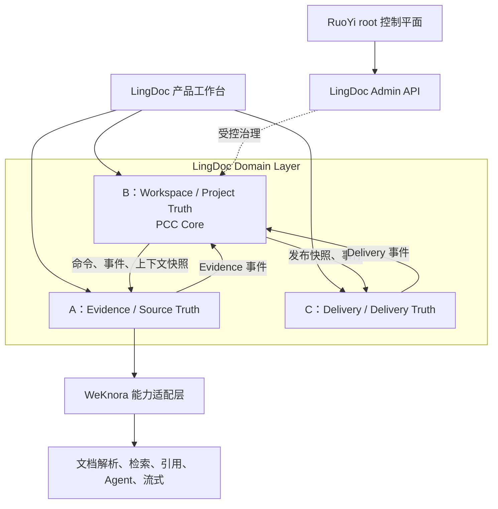

# 领域架构与关联变更协调机制（PCC）

> **后续设计参考**：本文保留完整产品方案；本轮范围见[实施方案](../08-本轮实施方案/01-范围与任务流程.md)，领取以[任务池](../TEAM_DEVELOPMENT_TASKS.md)为准。A/B/C 仅指领域，不分配人员。完整 PCC、复杂权限等不自动成为本轮前置条件。

## 1. 逻辑架构



### 边界

- **WeKnora** 复用为知识能力底座。它现有的异步处理、检索、引用和 Agent 能力由 A 通过适配层使用；LingDoc 不直接把业务对象绑定为 WeKnora chunk ID。
- **LingDoc B** 是研究项目的业务真相源：项目条件、主张、章节、变更、确认、上下文版本和任务状态均在此处拥有权威写入点。
- **LingDoc C** 拥有模板、模板检查、预检、路线图交付表示和导出；它读取已发布的项目快照，不反向改写 B 的项目内容。
- **RuoYi** 仅可通过私网/受控 Admin API 管理组织、模板发布、用量和审计；不可直连 LingDoc 或 WeKnora 业务表。模板的领域定义与规则实现归 C Delivery，RuoYi 只负责其发布与生效的治理流程，不写模板业务记录。

## 2. PCC 的问题定义

研究对象、目标、方法、变量、资源条件、材料或模板的变化，可能同时影响证据、主张、章节、图表和交付规则。如果异步任务各自返回、各模块各自更新，系统会出现“证据属于旧项目、正文属于新项目、导出仍显示可用”的多个现在。

PCC 负责把一次实质修改转化为一个可追踪的闭环：

```text
Change Capture → Semantic Delta → Dependency Resolve → Invalidation
→ Domain Tasks → Review & Confirmation → New Stable Baseline
```

PCC 不拥有证据是否有效、文本是否正确或模板是否合规的全部规则；它只记录变更、计算依赖范围、路由任务、追踪完成和宣布稳定状态。

## 3. PCC 核心对象与职责

| 组件 | B/PCC 的职责 | 不应承担的职责 |
|---|---|---|
| ChangeSet | 暂存拟议修改、基线版本、变更说明、负责人决定 | 直接覆盖正式项目状态 |
| ContextRevision | 为每次已应用的实质项目变化生成单调递增版本 | 代替材料、内容或模板自己的版本谱系 |
| DependencyRegistry | 保存跨域对象之间显式、可解释的依赖边 | 仅靠模型语义猜测替代所有显式关联 |
| ImpactResolver | 将受影响边转换为动作类型和优先级 | 执行 A/C 内部业务判断 |
| TaskRouter | 创建并路由领域任务，跟踪幂等键与完成状态 | 指挥 A 如何检索或 C 如何渲染文件 |
| Stabilization | 所有阻断影响关闭后生成稳定基线和交付快照 | 隐藏未解决事项以获得 READY |

## 4. ChangeSet 与 Context Revision

### 4.1 两阶段修改

用户的新想法先进入 `ChangeSet`，不立即污染已确认的项目状态。

```text
Context Revision 117（稳定）
        ↓
ChangeSet CS-42（增加“家庭资源”变量）
        ↓  影响评估、负责人决定应用
Context Revision 118（已应用，待重新稳定）
```

ChangeSet 至少记录：`id`、`project_id`、`base_revision`、`author`、结构化 `delta`、影响预览、决定记录和状态。

### 4.2 异步防陈旧规则

每个读取项目语义后运行的异步任务必须带 `based_on_revision` 和 `idempotency_key`。结果落库时遵守：

```text
result.based_on_revision == project.current_context_revision
    → 可以进入当前候选/待核状态
否则
    → 标为 STALE；不可覆盖较新状态；按规则提示或重新排队
```

这条规则保护解析后重检、RAG、章节生成、路线图重绘和预检等所有异步结果。

**唯一的例外是按语义判读，而不是按数字判读**：`Context Revision 0 → 1` 不改变项目语义，它只是把草稿期内容冻结为正式基线（见 [`07-建项阶段设计`](07-建项阶段设计.md) 第 5.3 节）。因此草稿期（`based_on_revision = 0`）产生的语义相关结果——例如调研候选池——在立项确认后**继续有效，不标 `STALE`**；否则立项这个动作会把用户在建项前积累的东西整片作废。这条例外只对 `0 → 1` 成立，`117 → 118` 这类实质变更仍按上式的机械比较执行。

## 5. 依赖图与局部失效

依赖图是“谁依赖谁”的业务记录，而非将全部原文复制一遍。

```text
ProjectSpec.population
  ├─> ResearchClaim C3
  ├─> Chapter.method
  └─> RouteNode.R7

ProjectAsset A1 → EvidenceCard E12 → ResearchClaim C3 → Chapter 2 → ReleaseItem X8
```

一次变更从变更节点沿允许传播的边找到后代，只使受影响对象失效或待审：

- 新增/修改研究条件：可能触发证据重校验、章节复核、路线图重生成、交付阻断；
- 材料重解析或权限撤销：相关证据退回 `NEEDS_REVIEW`，由 B 决定引用它的主张是否失去确认；
- 模板版本升级：内容不自动改写，但 C 重跑模板检查，并使既有快照的预检结果失效；
- 纯排版编辑：不应让无关证据重新检索。

边必须有 `relation_type`、`origin`（人工/规则/模型建议）、置信度、来源说明和有效状态。模型发现的“可能依赖”先作为候选边，不能直接形成不可撤销的业务事实。

## 6. 影响动作统一词表

| 动作 | 含义 | 典型处理者 |
|---|---|---|
| `REVALIDATE_EVIDENCE` | 检查现有 EvidenceCard 仍是否支持当前 ResearchClaim | A |
| `RETRIEVE_CANDIDATES` | 在允许范围检索补充证据候选 | A |
| `REVIEW_REQUIRED` | 人工需复核内容、事实或关系 | B（分派给人） |
| `REGENERATE` | 重新生成候选章节/路线图/交付内容 | B 或 C |
| `RECOMPUTE` | 重新计算规则或派生数据 | 所属领域 |
| `INVALIDATE_CONFIRMATION` | 旧确认不再适用于新版本 | B |
| `BLOCK_RELEASE` | 未解决问题禁止正式导出 | C |
| `NO_ACTION` | 有依赖但本次差异不改变该对象 | 所属领域说明理由 |

## 7. 领域协作示例

用户将研究对象从“普通本科生”改为“接受过创业教育的本科生”。

1. B 创建 `ChangeSet`，显示预估影响后由负责人确认应用，产生 Revision 118。
2. PCC 从依赖图得到 `EvidenceCard E-17`、方法章节、进度、路线图等。
3. B 向 A 发送 `RevalidateEvidenceCard(E-17, revision=118)`；A 用 WeKnora 检索/重排/定位原文，返回 `INSUFFICIENT` 或候选结果。
4. B 将受影响主张和章节标为 `REVIEW_REQUIRED`，旧确认失效；不自动把候选结果写成正式文本。
5. B 发布新的 `ReleaseSnapshot`（`workspace.release_snapshot_changed.v1`）；C 运行预检，若路线图仍使用旧对象，发出 `delivery.issue_detected.v1`（规则 `ROUTE_OUTDATED`）并阻断交付。
6. 人工处理所有任务、重新确认；PCC 仅在阻断影响均关闭且结果未陈旧时标记该 Revision `STABILIZED`，C 才能 `READY`。

## 8. AI 上下文装配

统一的只是**项目上下文视图**，不是统一的可任意写入知识库。`Context Assembler` 为任务创建最小上下文切片：

| 任务 | 允许输入 |
|---|---|
| 证据重校验 | 当前研究问题、目标主张、许可材料范围、当前 Revision |
| 章节候选稿 | ProjectSpec、当前章节、相邻章节摘要、已确认/待核证据、未解决影响 |
| 模板检查 | 当前章节与主张版本集合、TemplateProfile、规则版本 |
| 导出预检 | ReleaseSnapshot、TemplateProfile、确认汇总、规则版本 |

切片必须携带资料授权范围和 Revision；未授权原文、已撤销资料或过期上下文不得进入模型调用。

## 9. 初稿生成期间引入新参考文献

这是一个并发场景，必须区分“上传新材料”和“把新材料纳入当前生成依据”两件事。

### 9.1 推荐处置流程

```text
用户上传新文献
        ↓
ProjectAsset PROCESSING / READY
        ↓
进入项目资料候选区（不自动改变运行中的生成任务）
        ↓
用户选择：加入本次重生成，或仅供下一轮使用
```

正在运行的 `GenerateChapterCandidate` 必须保存不可变的输入快照：

```text
run_id
based_on_context_revision
asset_scope_revision
selected_asset_refs
selected_evidence_relations
prompt/config revision
```

因此，新文献不会在任务中途“悄悄混入”，也不会改变已经展示给用户的候选稿。

### 9.2 用户可选择的三种动作

| 用户动作 | 系统行为 |
|---|---|
| 保留当前初稿 | 当前任务按原资料快照完成；新文献标记为可用于下一轮，不改变当前候选稿 |
| 用新文献重生成 | 取消或完成当前任务后，创建新的候选稿版本，明确显示新增文献和差异 |
| 先做证据影响检查 | A 检查新文献是否支持、补充或反驳现有主张；结果交给 B 决定是否使确认失效 |

### 9.3 什么时候升级为 Context Revision

- 仅上传并解析新文献：不必修改当前项目语义，可停留在候选资料状态。
- 用户把新文献加入本项目的有效资料范围：更新 `asset_scope_revision`；若该资料范围属于项目正式上下文，则产生新的 `Context Revision`。
- 用户根据新文献接受新主张、修改研究条件、替换证据或改变章节结论：必须通过 `ChangeSet` 产生新的 `Context Revision`。

**草稿阶段是例外**：此时（`Context Revision 0`）研究条件尚未成为正式基线，草拟与修改不产生 `Context Revision`，也不需要 `ChangeSet`——`ChangeSet` 存在的理由是保护已确认的基线，而草稿期没有可保护的基线。基线在立项确认时一次性成立。

这样既不会因为每次上传都让全项目重算，也不会让正式确认继续隐藏地依赖变化后的资料集合。

### 9.4 旧任务返回时的判定

若生成任务返回时其 `context_revision` 或 `asset_scope_revision` 已落后：

```text
结果可以保存为历史/陈旧候选稿
但不能直接覆盖当前章节、确认状态或 ReleaseSnapshot
```

UI 应明确显示“基于旧资料快照生成”，并提供“比较并重生成”操作。若新文献与已确认主张冲突，A 发布证据事件，B 使相关确认进入 `REVIEW_REQUIRED`，C 在必要时阻断交付；任何域都不能直接静默改写正文。
