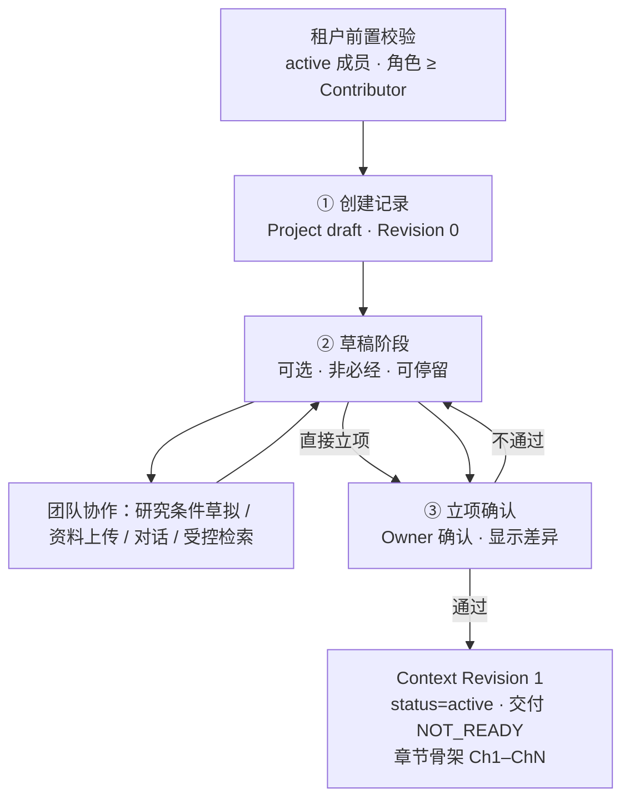

# 建项阶段设计

建项阶段是把一段尚未成形的研究构想，固化为系统可以据此判定“哪些内容有依据、哪些确认还有效、这次修改影响了什么”的项目基线的完整过程。它内部分三步：

```text
① 创建记录  →  ② 草稿阶段  →  ③ 立项确认
```

「创建记录」是一次轻量写入，只落一条处于草稿态的 `Project`；「草稿阶段」是团队把想法谈清楚、把材料收进来、把研究条件草拟出来的持久化中间态，**可选、非必经**；「立项确认」是全流程唯一的闸门，在此生成 `Context Revision 1` 与章节骨架，项目正式成立。

本文描述这一阶段的定位、产物、不变量与判据；实体字段与接口契约见 [`03-数据模型与接口契约`](03-数据模型与接口契约.md)，界面流程见 [`09-用户界面与交互规划`](09-用户界面与交互规划.md) 第 5 节，权限语义见 [`08-权限设计与复用WeKnora`](08-权限设计与复用WeKnora.md)。

## 1. 阶段定位

两件事决定建项必须先于其他阶段交付：

- **它是 PCC 的唯一入口**。`ChangeSet` 必须携带 `base_revision` 才能被评估与应用（见 [`02-领域架构与PCC`](02-领域架构与PCC.md) 第 4.1 节）。没有 `Context Revision 1`，就没有任何可比的基线，变更评估、影响预览与旧确认失效都无从判定。
- **它确定 Owner**。`changeset.apply`、`delivery.export` 与 `project.archive` 仅 Owner 持有，项目不得处于无 Owner 状态（见 [`08-权限设计与复用WeKnora`](08-权限设计与复用WeKnora.md) 第 4 节）。Owner 由建项产生，不由邀请产生。

阶段边界如下：

| 建项阶段做 | 建项阶段不做 |
|---|---|
| 选定已验证模板，在立项确认时生成章节骨架 | 自定义或新建申报模板（属 P5 的新模板验证流程） |
| 结构化录入、确认研究条件 | 替用户决定选题、研究方法或变量设计 |
| 生成 `Context Revision 1` 并落审计 | 产生任何正文、证据卡或交付快照 |
| 授权成员、治理角色与职能角色 | 生成正式内容或确认 |
| 绑定初始资料范围，或声明稍后确定 | 替代主管部门审核 |
| 草稿阶段可上传资料、对话、受控检索 | 让检索结果自动成为正式证据 |

## 2. 端到端流程



整条链路上只有一个闸门：立项确认。其余步骤都是为这个确认准备输入，或为确认后的协作准备边界。

## 3. 第一步：创建记录

### 3.1 前置与写入

前置校验与 [`08-权限设计与复用WeKnora`](08-权限设计与复用WeKnora.md) 第 4 节一致：调用者须是本租户 `active` 成员，租户角色 ≥ `Contributor`。

写入内容：一条 `Project`（`status = draft`、`owner_user_id`、`current_context_revision = 0`）与一条 `ProjectMember`（创建者，`governance_role = owner`）。**Owner 行的职能轴恒为空**，这是一条可校验的不变量（见 [`08-权限设计与复用WeKnora`](08-权限设计与复用WeKnora.md) 第 3.2 节）。

创建记录不写章节骨架、不产生 `Context Revision 1`、不涉及模板以外的任何交付对象。

### 3.2 Owner 的两种产生方式

真实课题组里，动手建项目的常常是研究生，而课题负责人是 Owner。因此创建记录支持指定负责人：

```text
创建者建项目（成为临时 Owner）
  → 同时指定负责人
  → 系统自动发起一次所有权转让
  → 受让人确认后原子生效
```

这条路径**复用既有的转让机制**，不新增机制：受让人确认之前创建者临时持有 `Owner`，项目**任何时候都不会出现零 Owner**（[`03-数据模型与接口契约`](03-数据模型与接口契约.md) 第 5 节的不变量照旧成立）。不指定负责人时，创建者即 Owner。

与转让一并确定的是**创建者自己的职能角色**。因为转让会让原 Owner 的职能轴按“未指定职能”处理（即 `Observer`），而在草稿期协作的场景里，创建者通常是最想留下干活的人。因此创建记录界面同时声明创建者的职能角色，转让后落到 `Member + <所声明职能>`，而不是把他锁成只读。

### 3.3 草稿项目的可见性

草稿项目对**创建者与被邀请成员**可见；对非成员一律走 [`08-权限设计与复用WeKnora`](08-权限设计与复用WeKnora.md) 第 10 节的 `404 project not found`，不泄露对象存在性。

草稿项目同样受 `owner_unavailable` 约束（见第 8 节），不设“无 Owner 的孤儿草稿”。

## 4. 第二步：草稿阶段

### 4.1 定位：向导的持久化中间态

草稿阶段不是一段新增的活动，而是**四步向导可以停在中间**这件事本身。有人一次走完四步直接立项确认；有人选完模板、草拟出研究条件就停下来，去聊、去检索、去上传，过两天再回来。因此：

- 草稿阶段**可选、非必经**。把草稿画成必经站点，会让“我有现成方案，直接立项”看起来像走了违规路径，而 [`01-产品蓝图与范围`](01-产品蓝图与范围.md) 的定位是“已有项目知识优先”。
- 草稿阶段**不做默认着陆页**。入口是项目列表页与建项向导第一屏的旁路，不是新用户的默认落点——否则“没有项目”会变成常态，与“以科研申报项目为工作单元”的定位打架。
- 草稿阶段的每一步都**可离开、可回来**，未保存内容不静默丢失（见 [`09-用户界面与交互规划`](09-用户界面与交互规划.md) 第 15 节）。

草稿期对应 `Context Revision 0`（空基线）。所有语义相关记录带 `revision = 0`，因此 [`03-数据模型与接口契约`](03-数据模型与接口契约.md) 第 1 节“每条记录带适用 Revision”的原则在草稿期不出现空洞。

### 4.2 协作：谁能进来、进来能做什么

真实的实验室或团队从草稿阶段就开始协作，而不是等立项之后。因此：

- **草稿期可以邀请成员，且一经接受立即 `active`**，不挂在 `invited` 上等立项——那会让“两个人一起理思路”这个场景做不到。
- 草稿期授予的是**不带章节 scope** 的角色；带章节 scope 的 `Author` 授权只能在立项确认之后，因为**章节那时才生成**（见第 5.1 节）。
- 草稿期的“一起理思路”= **共享对象**（`ProjectSpec` 草稿、项目资料、调研候选池），**不共享对话**。WeKnora 的会话所有权是 per-user 的，LingDoc 不改造它；因此 AI 填写的上下文只可能来自**自己的**会话。
- 草稿项目在项目列表中只对创建者与被邀请成员出现。

### 4.3 AI 填写与溯源

草稿阶段的 AI 填写**直接落入向导 Step 2 的对应字段**，复用既有的字段状态机（保存草稿 / 标记待确认 / 查看变更历史），不另造审核面板。三条硬约束：

1. **AI 产出的值默认 `待确认`，绝不默认已确认。** 系统允许生成候选值，但不允许把模型推断写成项目事实。
2. **每个 AI 产出的字段值必须携带溯源**：所依据的会话、轮次范围、实际采用的原文片段。产品关键体验是“哪些内容基于什么”（见 [`01-产品蓝图与范围`](01-产品蓝图与范围.md) 第 2 节），若 AI 填出的研究条件没有来源，`Context Revision 1` 从第一天起就含有无法回答“基于什么”的项目事实。
3. **填写不得降低质疑强度。** AI 填写与澄清问题是两条独立通道：填了“研究对象：普通本科生”，系统仍必须问样本边界是否包含不同年级、专业和地区（样例见 [`13-端到端课题申报模拟`](13-端到端课题申报模拟.md) 第 2.3 节）。系统要能对**自己刚填的值**提出质疑。

上下文的粒度沿用 [`10-调研智能体与知识沉淀规划`](10-调研智能体与知识沉淀规划.md) 第 7.1 节的既有契约：用户选择**轮次范围**，可跨多个会话多选；不允许一键把整段会话当作依据。

### 4.4 发现层与候选池

草稿期的受控检索复用 WeKnora 的 `web_search` / `web_fetch` 能力，不复制第二套搜索引擎。结果按 [`10-调研智能体与知识沉淀规划`](10-调研智能体与知识沉淀规划.md) 第 5 节既有的三层分档落位，**层级只决定它能否支撑证据，不决定能否导入**：

| 层级 | 能否导入项目资料 | 能否建立 `EvidenceCard` |
|---|---|---|
| 候选证据（有明确作者/机构、日期、可核验原文位置） | 可以 | 可以 |
| 背景线索（相关但论证、质量或授权待确认） | 可以 | 需先补足出处 |
| 仅作发现入口 · 聚合页 / 无稳定出处页面 | 可以 | **不可以**，补上原始出处后可显式升级 |
| 仅作发现入口 · 搜索摘要（未读原文） | **不可以** | **不可以**（结构上无法建立锚点） |

**特别说明“搜索摘要不得导入”这条**：它是结构结论而非政策——只拿到摘要意味着没有可重定位的原文位置，而 [`03-数据模型与接口契约`](03-数据模型与接口契约.md) 第 2 节的 `SourceAnchor` 要求 `locator` 与 `quoted_text_hash`、`EvidenceCard` 以 `anchor_id` 为必填，锚点无从建立，证据卡在数据模型上就构造不出来。

草稿期的候选池挂在草稿项目下、带层标记存活，**立项确认不改变其中任何一条的层级**。候选池是待选输入，既不进入 `Revision 1`，也不属于项目语义或资料范围。

### 4.5 换模板

草稿期换模板是自由的（骨架尚未生成），但字段集由模板的“必要字段”决定（见第 5.2 节），因此换模板会改变字段集。处置规则：

- 同名字段**按名匹配保留**；
- 原模板有、新模板没有的字段标为**“模板不再需要”**，是可见状态而非删除；
- 新模板需要而尚未填的字段标为**待填**。

不得因换模板清空已填字段——那些字段可能带有用户选择过的溯源，静默销毁等于抹掉依据。

## 5. 第三步：立项确认

### 5.1 骨架与基线

立项确认时生成章节骨架 Ch1–ChN（依所选 `TemplateProfile` 的章节结构），并产生 `Context Revision 1`。项目进入 `status = active`、`Delivery Status: NOT_READY`。

草稿期没有 `Chapter` 记录，因此不需要额外定义“草稿章节”的版本与状态语义。而成员 scope 以章节为对象，骨架必须早于任何一次带章节 scope 的授权——立项确认正好卡在这个位置。

### 5.2 确认什么

Owner 确认的是**整个研究条件草稿**，而不是逐字段重新点一遍。但正因为是整体确认，确认页**必须显示两类差异**：

```text
自你上次查看以来，被他人修改的字段：
  研究对象      李老师 → 王同学（3 天前）
  核心变量      + 家庭资源（王同学，2 天前）

仍是 AI 填写、未经人工改动的字段：
  拟用方法      会话 S-12 第 12—18 轮（3 天前）      [查看溯源]
```

草稿期没有 `ChangeSet`，因此**确认页是唯一的可见性关口**，不能省略。两类差异防的是同一个风险的两个面——整体确认会把 Owner 没亲自核过的东西一并冻结进基线：

- 只列「他人修改」，会让“别人改了研究对象、Owner 没看见就点了确认”成为默认路径；
- 不列「仍是 AI 填写」，会让一个模型填出、全程无人看过的字段被顺带确认。它与前者同样危险，却更隐蔽——它看起来“一直就在那儿”。

确认**不因字段是 AI 填写而被阻止**：Owner 的整体确认本身就是那个人工闸门，两类差异只要求被看见，不要求逐项签字。但**溯源必须随值进入基线**——`Revision 1` 之后仍要能回答“这个值当初是 AI 根据哪段会话、哪几轮填的”。字段的**来源**（人工填写 / AI 填写 / AI 填写后人工改动）与字段的**状态**（草稿 / 待确认 / 已确认）是两个正交的维度：确认只推进状态，不抹掉来源。

`ProjectSpec` 的字段集**由所选模板的必要字段决定**，不是全局固定的一组字段——“研究对象”是当前这一类模板的必要字段，落到别的申报类别未必存在。AI 填写同样按模板必要字段逐项进行。

### 5.3 立项确认不是一次语义变更

`Context Revision 0 → 1` 是 `ContextRevision` 序列里**唯一一次不改变语义的递增**：它把 `Revision 0` 的内容冻结为正式基线，而不是修改项目语义。由此有两条推论必须写清，否则后来人会把它与 `117 → 118` 当作同一类事：

- 建项阶段是**唯一不经 `ChangeSet` 产生 Revision 的入口**——首版基线没有可比的既有语义，所以由 Owner 一次性确认，而不是“对一个空基线做变更”。
- **基于 `Revision 0` 的产物在立项确认时不失效**。[`02-领域架构与PCC`](02-领域架构与PCC.md) 第 4.2 节的防陈旧规则是机械比较 `based_on_revision == current_context_revision`，在这里会误判：草稿期检索出的候选池、草稿期产生的语义相关结果，其依据的语义内容**等于** `Revision 1` 的内容，因此继续有效，不标 `STALE`。

### 5.4 确认之后的约束

基线成立后，**研究条件不能再被直接编辑**，任何实质修改都必须走 `ChangeSet` 的评估—应用两阶段（见 [`02-领域架构与PCC`](02-领域架构与PCC.md) 第 4.1 节）。系统不提供绕过入口。

草稿期授予的、**不带章节 scope** 的职能角色在立项确认后进入**“待指派”**状态：其对章节对象的写权为空，直到被指派章节 scope 为止。这条是 [`08-权限设计与复用WeKnora`](08-权限设计与复用WeKnora.md) 第 3.2 节“默认拒绝”的直接应用——`function_scopes` 为空对 `Owner` 意味着全集（它不参与职能轴），对其他治理角色意味着**尚未指派**，两者不可混同。

## 6. 产物与不变量

| 产物 | 所有者 | 建项阶段写下什么 | 不变量 |
|---|---|---|---|
| `Project` | B | `tenant_id`、`owner_user_id`、`status = draft → active`、`template_profile_id`、`current_context_revision = 0 → 1` | 有且仅有一个 Owner；`owner_user_id` 与 `governance_role = owner` 的成员行始终一致 |
| `ProjectMember` | B | 创建者与受邀成员；治理角色、职能角色、职能 scope | Owner 行职能轴恒为空；草稿期授的角色在章节 scope 指派前对章节写权为空 |
| `ProjectSpec` | B | 各模板必要字段的值、逐项状态、字段来源、AI 填写值的溯源 | 每条带自身 revision 与 status；**来源与状态正交**——立项确认推进状态但不抹掉来源，AI 填写过的值在 `Revision 1` 之后仍答得出依据哪段会话；实质变化后旧确认不得沿用 |
| 章节骨架 | B | 依 `TemplateProfile` 在立项确认时生成的 Ch1–ChN | 骨架由模板决定，不由模型自由生成 |
| 项目—知识库绑定与资料授权范围 | A | 项目可用资料集合 | 未授权资料不得进入任何模型上下文 |
| 调研候选池 | A/B | 草稿期检索结果，带层级标记 | 不进入 `Revision 1`；层级不因立项而改变 |
| `Context Revision 1` | B | 首个稳定基线 | 唯一不改变语义的递增；确认需记录行为人、时间、依据与理由 |

## 7. 权限：同一张矩阵，不做草稿期专用集

草稿阶段**没有专用权限集**：它就是同一张 capability 矩阵跑在 `Revision 0` 上。真正不同的不是“谁能做”，而是“有什么对象可做”。

- `content.confirm`、`evidence.confirm`、`delivery.*`、`route.edit` 在草稿期不是被禁止，而是**没有对象、自然空转**。
- 空转在 UI 上应当**不显示入口**，而不是显示一个灰掉的按钮——[`09-用户界面与交互规划`](09-用户界面与交互规划.md) 的规矩是“按钮按 capability 显示”，灰按钮会让用户以为是自己权限不够。
- **草稿期的研究条件草拟权 = `changeset.create` 的持有者**（`Owner` 与 `Member + Author`），不新增 capability。“提出研究条件”这件事的性质在基线前后没有变：变之前叫草拟，变之后叫提案。**确认权仍在 Owner**，与草拟权分开。
- 草稿期的联网检索受**租户级**搜索 provider 配置约束，LingDoc 不自己维护搜索提供方，也不加项目级联网开关。

两张权限表的代价是必然漂移——只要存在两张表，就一定会出现“某项能力在草稿期忘了开、立项后才突然可用”的意外，而 [`08-权限设计与复用WeKnora`](08-权限设计与复用WeKnora.md) 第 3.2 节的规矩是“始终以 capability 集合为准”。一张表才让这句话成立。

## 8. 异常与分歧路径

| 情形 | 系统行为 |
|---|---|
| 研究条件未通过人工复核 | 留在草稿/待确认，不进入正式项目基线；项目停在草稿态，不产生 `Context Revision 1` |
| 模板覆盖范围不足 | Step 1 显式告知未支持部分，不静默降级；Beta 不提供建项期的模板自定义 |
| 草稿期换模板 | 同名字段保留，未匹配字段标“模板不再需要”，缺失字段标待填；不清空 |
| 资料范围暂时无法确定 | 允许“稍后上传”，基线仅由模板与研究条件定义，资料集合为空集 |
| 受邀成员不在本租户 | 按 [`08-权限设计与复用WeKnora`](08-权限设计与复用WeKnora.md) 第 8.2 节分支：同一次操作内完成租户邀请与项目授权，或生成“需租户管理员协助”的待办并说明原因 |
| 受邀成员未接受邀请 | `status = invited`，不产生任何项目能力；不阻塞项目推进 |
| 指定负责人后迟迟未确认 | 创建者继续以临时 Owner 持有项目，三项 Owner 独有能力可用；项目不进入零 Owner 状态 |
| 创建者或 Owner 的租户身份在建项期失效 | 项目进入 `owner_unavailable`，仅冻结 Owner 独有的三项能力；按 [`08-权限设计与复用WeKnora`](08-权限设计与复用WeKnora.md) 第 4 节由租户 Owner 或平台管理员指定受让人发起转让 |
| 草稿长期不立项 | 超期提醒 + 可显式丢弃：写软删除标记 `discarded_at`（保留审计与恢复入口），**不改 `status`、也不复用归档**——归档的语义是“项目已结束”，丢弃是“这段构想未成立”，两者不该共用一个状态；**系统不自动丢弃、也不自动归档**——把一个人未完成的想法悄悄冻结，会让用户回来时看到“已归档”而不是“你上次停在哪” |
| 立项确认后要修改研究条件 | 不再属于建项阶段，走 `ChangeSet`；系统不提供绕过入口 |

## 9. 验收口径

- **产品验收**（[`01-产品蓝图与范围`](01-产品蓝图与范围.md) 第 7 节场景 1）：用户能创建记录进入草稿阶段、邀请一名成员共同草拟研究条件（含 AI 填写并回看溯源）、完成立项确认。
- **质量验收**（[`15-质量验收与上线运行`](15-质量验收与上线运行.md) 第 2 节“权限与资料边界”“建项与基线”、第 3 节 AC-01/AC-02）：不泄露对象存在性/原文；模型上下文不包含未授权资料；建项与草稿期的三条边界同时成立。
- **UI 验收**（[`09-用户界面与交互规划`](09-用户界面与交互规划.md) 第 16 节第 1 条）：用户能在 30 秒内回答“当前项目是什么、当前版本是什么、下一步做什么”——建项结束时项目首页必须已能回答这三问。
- **评审提问**（[`06-路线图与里程碑`](06-路线图与里程碑.md) 第 8 节）：用户能否完成本阶段承诺的动作而非只看到页面；每个关键结果能否说明其项目、版本、来源和责任人。
- **P0 退出口径**（同上第 3 节）：任何开发者均能描述对象所有者、版本和跨域路径。
- **反面口径**：不得以“填完了表单”“生成了一段完整的研究条件描述”或“模板骨架已渲染”作为建项阶段验收通过。

## 10. 阶段落点

| 阶段 | 与建项相关的交付 |
|---|---|
| P0 | 定义 `Project` 与 WeKnora tenant / knowledge base 的关系，画出权限与数据流；固化状态枚举、版本命名、事件信封与审计字段；建立脱敏测试项目 |
| P1 | `Project`（含草稿态与 `Revision 0`）、`ProjectMember`、双轴角色模型与 capability 映射、职能 scope、项目—知识库绑定、统一鉴权链路、所有权转让；草稿阶段的团队协作、AI 填写与受控检索最小闭环（对话 + 检索 + 候选池）、草稿丢弃的软删除标记，导入确认与来源谱系留 P2 |
| P4 Beta | 权限模型不变，按真实使用调整各职能的 scope 默认值 |
| P5 | 新模板验证流程、机构级协作等扩展 |

两条必须同时满足的约束：

- **P0 禁区**（[`06-路线图与里程碑`](06-路线图与里程碑.md) 第 3 节）：未定 `ProjectAssetRef` 前不要把 WeKnora chunk ID 写进主张表；未定 Revision 前不并发开发自动生成、预检与导出。
- **同阶段交付**（同文档第 4 节、[`08-权限设计与复用WeKnora`](08-权限设计与复用WeKnora.md) 第 11 节）：职能 scope 必须与鉴权链路一起交付。缺少 scope 输入源，鉴权链路的 scope 检查恒为全集、等于空转。

## 11. 常见误读

| 误读 | 实际 |
|---|---|
| 建项 = 建一个知识库 | 项目是 LingDoc 的主边界，知识库是 WeKnora 的资源单位，两者只通过绑定关联 |
| 建项 = 开一个聊天会话 | 会话是交互载体，`Project` 才是业务单元 |
| 草稿阶段是必经的预研环节 | 它是向导的持久化中间态，可选、非必经，可以一次走完四步直接立项 |
| 草稿期是一套缩水的权限 | 同一张 capability 矩阵，只是部分条目没有对象可作用而空转 |
| 草稿期是单人作业 | 可以邀请成员且立即生效——真实的实验室从草稿期就开始协作 |
| AI 填写等于 AI 定稿 | 填入的值默认待确认、必须带溯源，且系统仍会对自己填的值提出问题 |
| 研究条件 = 一段提示词 | `ProjectSpec` 是带版本、状态与溯源的模板必要字段集合，实质修改走 `ChangeSet` |
| `Revision 0 → 1` 和 `117 → 118` 是一回事 | 前者不改变语义，只是冻结；后者是实质变更 |
| 丢弃草稿 = 归档项目 | 丢弃是 `draft` 的软删除标记，语义是“这段构想未成立”；归档是 `active` 的终态，语义是“项目已结束”。两者不共用一个状态 |
| 搜索摘要可以当资料导进来 | 摘要没有可重定位的原文位置，锚点构造不出来；聚合页可导入但不能直接支撑证据 |
| 基线确认后还能随手改研究对象 | 基线成立后只能经 `ChangeSet` 修改，系统不提供绕过入口 |
