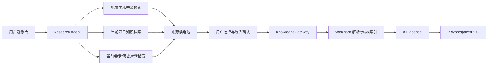

# 调研智能体与知识沉淀规划

> **后续设计参考**：本文保留完整产品方案；本轮范围见[实施方案](../08-本轮实施方案/01-范围与任务流程.md)，领取以[任务池](../TEAM_DEVELOPMENT_TASKS.md)为准。A/B/C 仅指领域，不分配人员。完整 PCC、复杂权限等不自动成为本轮前置条件。

## 1. 为什么需要独立的调研智能体

用户的研究过程不是“先上传 PDF，再开始写作”，而是：

```text
新想法 → 与 AI 澄清问题 → 受控学术来源检索和阅读
       → 发现新概念/变量/反例 → 引入新资料
       → 回到项目上下文继续写作或润色
```

这条流程的**前半段（澄清问题与检索）落在草稿阶段**：项目已创建但尚未立项，处于 `Context Revision 0`，还没有章节与主张；**后半段（引入资料、回到写作）落在立项之后**。两段共用同一个调研智能体，区别只在于立项前没有可支撑的对象，因此检索结果停留在候选池，不产生证据。

因此，调研应成为 Agent 体系中的正式能力，而不是普通聊天里临时打开的搜索工具。它解决两个问题：

1. 将模糊想法拆成可执行的检索计划；
2. 将调研中的外部来源和高价值 AI 对话，经过用户选择后沉淀为可追溯项目材料。

“搜到”不等于“已入库”，“入库”不等于“已成为证据”，“对话说过”也不等于“研究事实”。这三个层次必须在 UI 和数据模型中分开。

## 2. Agent 定位与边界

### 2.1 负责什么

调研智能体（Research Agent）是 LingDoc 的一个受控 Agent 角色，负责：

- 根据用户的新想法生成概念、问题、关键词、同义词和排除条件；
- 在机构批准的学术来源提供方中执行检索、元数据读取和允许的文献获取；
- 对结果去重、聚类、比较并标注相关性、质量和不确定性；
- 让用户选择来源、页面片段或 AI 对话片段，生成导入候选；
- 将用户确认的候选交给 A Evidence，转为 ProjectAsset、SourceAnchor 和 EvidenceCard 候选。

### 2.2 不负责什么

- 不把搜索结果自动写入正式项目知识；
- 不保证来源真实、权威、完整或适用于当前研究；
- 不自动把 AI 对话变成研究结论；
- 不绕过版权、个人信息、资料授权和网络出口策略；
- 不自动覆盖正在编辑的章节或已确认内容；
- 不替负责人判断研究问题、理论路径、证据适切性或最终引用。

## 3. 与 WeKnora 和现有 Agent 的关系



WeKnora 的检索、文档处理、会话、Agent 工具和引用能力作为适配底座；外部学术来源必须先经过 LingDoc/机构的来源目录、授权和质量规则。LingDoc 新增的是调研任务编排、来源候选池、对话片段导入、授权/谱系和项目关联；不应复制第二套搜索或 RAG 引擎。

## 4. 调研工作区 UI

### 4.1 入口与上下文

用户可从**草稿阶段的研究条件页**、项目总览的“开始调研”、章节编辑器的“围绕此处调研”或研究助手中的“调研智能体”进入。进入时必须显示当前上下文。立项之后：

```text
项目：数字平台课题
关联章节：Chapter 2 国内外研究现状
Context Revision：2
已允许资料：M-01、M-02、M-03
学术来源：已开启（目录版本：……）
```

草稿阶段没有章节与主张，上下文相应退化为项目与研究条件本身：

```text
项目：数字平台课题（草稿）
关联章节：—
Context Revision：0（尚未立项）
已允许资料：M-01、M-02
来源：租户已配置的搜索能力与学术来源目录（目录版本：……）
```

两个阶段的调研共用同一套任务卡、结果分层与候选池，区别只在于**候选池的产物在草稿期只能停着**：没有主张可以关联，因此不产生证据（见 [`07-建项阶段设计`](07-建项阶段设计.md) 第 4.4 节）。

### 4.2 调研任务卡

调研智能体先创建任务卡，不立即搜索：

```text
研究想法：家庭资源可能影响创业教育与创业意向的关系
问题：定义和测量方式？是否存在调节效应研究？本项目是否适用？
范围：中文/英文；2015—2026；论文和政策材料
排除：无作者、无出处、无法定位原文
输出：候选来源 + 比较表 + 待验证问题
```

用户可以修改任务卡，再点击“开始调研”。

### 4.3 结果工作区

```text
左栏：调研问题、搜索轮次、已导入数量
中栏：来源结果、网页正文、AI 回答
右栏：来源详情、权限、关联主张、导入队列
```

结果卡至少显示标题、作者/机构、发布日期、URL、检索时间、来源类型、摘要、相关性、质量提示、导入状态和人工确认状态。

## 5. 受控学术来源流程

调研智能体可以拆成多轮查询，并保留每轮查询词、来源目录版本、提供方、时间、结果集合和用户反馈：

```text
Round 1：家庭资源 entrepreneurship intention definition
Round 2：family resources entrepreneurial education moderation
Round 3：measurement scale undergraduate China
Round 4：反例、不显著结果和替代解释
```

用户可以改关键词、排除来源、继续追问。结果分层为：

- 可作为候选证据：有明确作者/机构、日期、原文位置和可核验来源；
- 可作为背景线索：相关但论证、质量或授权仍需确认；
- 仅作发现入口：搜索摘要、聚合页或无稳定出处页面。

分层是辅助意见，不代替负责人或学科专家判断。

**分层决定的是“它能否支撑证据”，不是“它能否被导入”**——这条区分很重要，因为两者很容易被混为一谈：

- **搜索摘要（未读原文）不得导入**。这是结构结论而非政策：只拿到摘要意味着没有可重定位的原文位置，而 [`03-数据模型与接口契约`](03-数据模型与接口契约.md) 第 2 节的 `SourceAnchor` 要求 `locator` 与 `quoted_text_hash`、`EvidenceCard` 以 `anchor_id` 为必填，锚点无从建立。摘要的作用是帮你判断“值不值得读原文”。
- **聚合页与无稳定出处页面可以导入**，但只能以“背景线索”层级导入，不得直接建立 `EvidenceCard`——引用转载页等于引用二手出处，页面失效后 `16-术语表` 所述的失效检测也无从做起。**用户可以补上原始出处后显式升级为候选证据层**，升级是显式动作并留审计：规则判断同样必须能被人工推翻，这与“误报删除”是同一条原则。

联网检索本身复用 WeKnora 的 `web_search` / `web_fetch` 能力与租户级 provider 配置，LingDoc 不维护第二套搜索引擎，也不新增项目级联网开关。经目录批准的学术来源与一般网页搜索共用这一条通道，区别在于前者有目录版本与许可声明可记，后者只能落到发现入口或背景线索层。

用户点击结果卡后打开文献预览，可选中标题、摘要或允许保存的正文、表格片段，加入“导入候选”。**此处的摘要是原文里可定位的摘要段，不是搜索引擎返回的无出处摘要**——后者按上文规则不得导入，因为它在数据模型上建立不出 `SourceAnchor`。来源卡本身不直接成为项目证据。

## 6. 来源导入项目资料

### 6.1 两阶段导入

```text
学术来源结果/允许获取的文献
  → 用户选择来源和片段
  → ImportCandidate（候选导入）
  → 用户确认权限、资料范围和用途
  → KnowledgeImport
  → KnowledgeGateway
  → ProjectAsset PROCESSING → READY
```

导入对话框让用户选择：导入项目/资料范围、保存允许的全文还是链接+摘录、是否允许后续模型检索、是否仅作背景、是否创建待核来源任务。

导入时需带**层级标记**：以“背景线索”或“仅作发现入口”层导入的材料，在建立 `EvidenceCard` 时按标记校验出处是否能重定位——发现入口层会被拦下并要求补齐原始出处，补足后可显式升级。未经标记的默认是最低层，不做善意推定。

### 6.2 来源谱系

导入后的 `ProjectAsset` 保留原始 URL、最终 URL、标题、作者/机构、发布时间、检索/获取时间、来源目录版本、许可声明、选取片段和导入者。来源变更或链接失效时，A 发布资料修订/失效事件，相关 EvidenceCard 进入复核，不静默替换原文。

## 7. AI 多轮回答导入项目资料

### 7.1 可选择的对象

用户可以选择某一轮问答、多轮对话中的研究笔记/比较表、回答引用的来源清单，或自己补充并确认的笔记。默认不允许一键把整段会话当作事实资料。

### 7.2 导入界面

```text
选择范围：第 12—18 轮
导入形式：原始对话 / 用户研究笔记 / 来源清单 / 待核证据候选
用途：项目资料 / 个人草稿 / 仅本次调研
包含 AI 推断：是（导入后标记 AI_GENERATED_CANDIDATE）
需要人工确认：是
```

对话材料保存会话 ID、轮次范围、生成时间、模型/工具（若可用）、引用来源、导入者、导入时 Revision 和下述分类。

草稿阶段的导入走同一条链路，但资料进入的是**草稿项目的资料范围**，并在立项确认后继续受同一 `authorization_scope` 约束——立项不会让授权范围变宽或变窄。

导入材料按内容**分类**（分类描述“这是什么材料”，与 `ProjectAsset` 的处理状态 `PENDING`/`PROCESSING`/`READY` 正交，不是同一套枚举），至少区分：

```text
CONVERSATION_NOTE       研究笔记/过程记录
AI_GENERATED_CANDIDATE  AI 提出的未确认观点
SOURCE_LIST              外部来源清单，需逐项核验
HUMAN_CONFIRMED_NOTE    用户确认后的项目笔记
```

即使导入对话，AI 推断也不能自动成为 `EvidenceCard.CONFIRMED`；引用仍需回到原文定位和适用性确认。

## 8. 新资料与正在生成的初稿

调研导入和初稿生成遵守资料快照规则：

- 生成任务固定 `context_revision`、`asset_scope_revision` 和 ProjectAsset 列表；
- 新资料默认进入候选区，不静默混入当前生成；
- 用户可保留当前初稿、用新资料重生成或先运行证据影响检查；
- 若新资料导致研究条件/主张变化，创建 `ChangeSet`，由 PCC 让相关确认失效并生成影响任务；
- 旧任务返回时若版本落后，只保存为 `STALE`/历史候选，不能覆盖当前章节或 ReleaseSnapshot。

## 9. 数据模型与接口

| 实体 | 用途 | 关键字段 |
|---|---|---|
| `ResearchRun` | 一次调研任务和多轮搜索容器 | project_id、query_plan、scope、provider、catalog_rule_version、status、context_revision |
| `AcademicSource` | 经目录批准的学术来源元数据 | canonical_url、title、author、published_at、retrieved_at、catalog_rule_version、license |
| `ResearchExcerpt` | 用户选择的文献/对话片段 | source_ref、locator、text_hash、selection_type |
| `ConversationExcerpt` | 选定的 AI 对话范围 | session_id、turn_range、model、tool_refs、author_types |
| `ImportCandidate` | 尚未进入资料范围的候选 | source/excerpt refs、target_scope、purpose、status |
| `KnowledgeImport` | 已确认的导入动作 | candidate_id、project_asset_id、consent、processing_run、imported_by |

主要命令：

```text
StartResearchRun
SearchResearchSources
InspectAcademicSource
CreateImportCandidate
ConfirmKnowledgeImport
SelectConversationExcerpt
ImportConversationExcerpt
```

主要事件：

```text
research.run.completed.v1
academic.source.selected.v1
knowledge.import.requested.v1
knowledge.import.completed.v1
conversation.excerpt.imported.v1
evidence.project_asset_scope_revision_changed.v1
```

所有结果和导入动作均带项目、授权范围、Revision、关联 ID 和审计信息。

## 10. 安全、合规与成本

- 出站仅经过批准的学术来源提供方，防 SSRF、恶意文件、重定向和提示注入；
- 页面内容是不可信数据，不能让网页指令改变 Agent 工具权限或项目状态；
- 导入全文前提示版权/授权；无法保存全文时退回链接、摘录和来源元数据；
- 对话导入前提示个人信息、密钥、未公开研究计划和错误推断风险；支持脱敏、局部选择和删除；
- 搜索、抓取、模型调用和导入按项目配额计量；
- 私有资料不因被调研智能体读取就自动成为公共知识或跨租户训练数据。

## 11. 与其他 Agent 的责任边界

| Agent/域 | 负责什么 | 不负责什么 |
|---|---|---|
| 调研智能体 | 发现问题、搜集来源、整理候选、准备导入 | 最终证据确认、修改正式章节 |
| A Evidence | 解析 ProjectAsset、定位来源、评估 EvidenceCard 状态 | 决定研究方案或导出 |
| B Workspace/PCC | 管项目语义、主张、变更、确认和任务收敛 | 代替 A 判断原文支持关系 |
| C Delivery | 模板、模板检查、预检、路线图交付和导出 | 修改研究内容或替用户确认 |
| 普通写作/审校 Agent | 生成候选稿、润色、检查表达 | 擅自网络搜索并写入知识库 |

## 12. 路线图与验收

### P1：草稿阶段的调研最小闭环

- 复用 WeKnora 的 `web_search` / `web_fetch` 作为发现层，不复制第二套搜索引擎，不新增项目级联网开关；
- 草稿阶段可围绕研究想法对话与检索，结果进入候选池并带层级标记；
- 候选池在立项确认时**层级不变、结果不失效**（见 [`02-领域架构与PCC`](02-领域架构与PCC.md) 第 4.2 节的语义判读例外）；
- 草稿阶段上传的资料在立项确认后受同一 `authorization_scope` 约束；
- 草稿阶段不产生 `EvidenceCard` / `ResearchClaim`——没有主张可关联。

### P2：来源沉淀

- 支持一个已批准的学术来源提供方，并在检索中与一般网页搜索分层；
- 支持调研任务卡、多轮检索、结果去重和来源卡片；
- 支持用户选择允许保存的文献片段导入项目资料；
- 支持从 AI 会话选择轮次导入研究笔记/来源清单；
- 导入时校验层级：发现入口层的材料不得直接建立 `EvidenceCard`，补足原始出处后可显式升级；
- 运行中的章节生成使用固定资料快照；
- 所有导入都有权限、状态和审计记录。

### 验收用例

1. 用户提出新变量，调研智能体生成检索计划并执行三轮搜索。
2. 用户选择一个来源和两个片段导入项目；导入完成后可在资料列表和检索结果中找到。
3. 用户从一段 AI 对话中只导入来源清单，AI 推断保持未确认状态。
4. 新资料导入时，正在运行的章节生成不会自动变化；用户点击重生成后才出现新版本。
5. 新文献反驳已确认主张时，系统创建证据复核任务并阻断相关交付，而不是直接改正文。
6. 用户撤销来源授权后，相关调研结果、EvidenceCard 和后续导出都能追踪到受影响范围。
