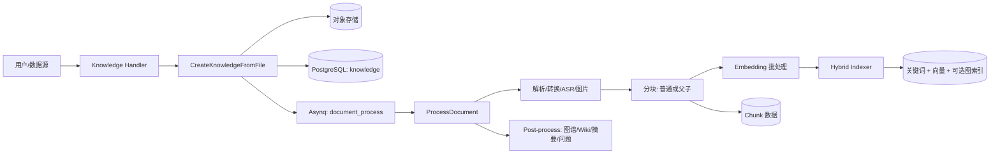
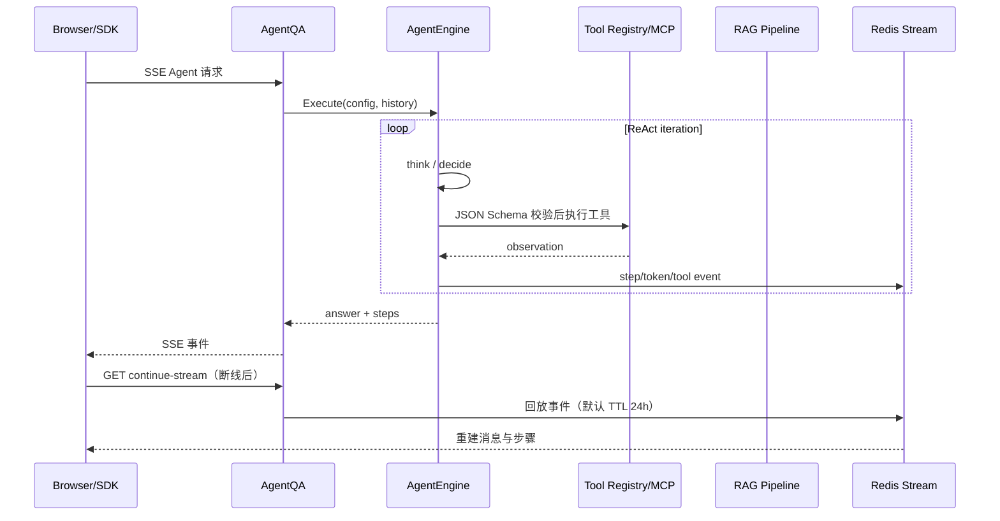
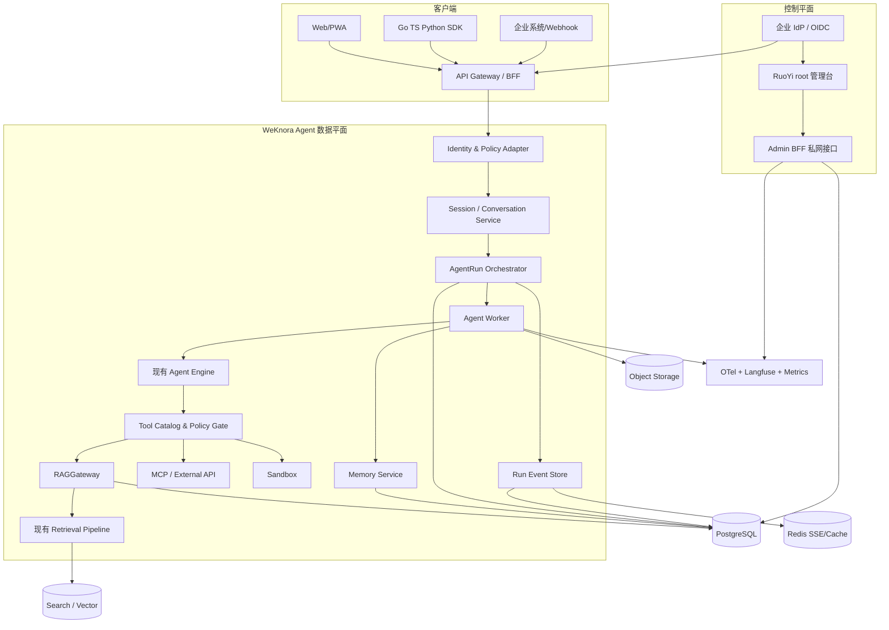
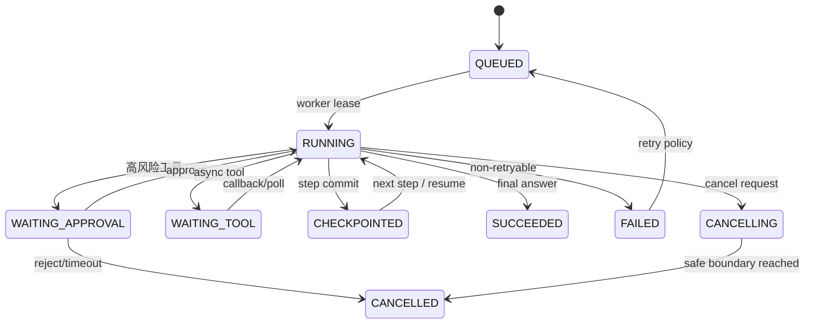
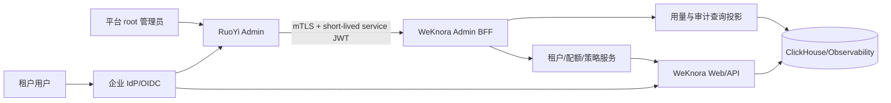
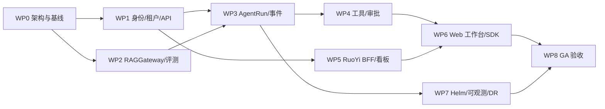

# WeKnora 二次开发：生产级 Agent 技术实施附件

> 文档状态：建议实施稿（2026-09-16）  
> 范围：以本仓库 `WeKnora` 为 Agent 与知识库数据平面，在其上交付面向最终用户的生产产品，并以 RuoYi 作为 root 级运营管理控制台。  
> 证据原则：第 2 章是源码事实；其余章节均明确标为目标设计或实施建议，避免将设计误作现有能力。

> **阅读顺序**
>
> 面向国家级课题申报场景的产品定位、能力边界和阶段范围，请先阅读 [顶层开发计划](PROJECT_TOP_LEVEL_DEVELOPMENT_PLAN.md)；申报模板与规则系统的系统契约见 [模板与规则系统设计](06-灵档产品开发规划/11-模板与规则系统设计.md)。本文保留工程实现、部署和交付细节，作为配套实施附件。
>
> 注意术语区分：本文第 4、8 节中的"模板"指 **Agent 工作流模板**（编排与工具发布），与申报结构模板不是同一个概念。

## 目录

- [1. 决策摘要与边界](#1-决策摘要与边界)
- [2. 源码现状分析](#2-源码现状分析)
- [3. 目标 Agent 架构](#3-目标-agent-架构)
- [4. 最终用户产品与 API](#4-最终用户产品与-api)
- [5. 非功能需求与安全基线](#5-非功能需求与安全基线)
- [6. 打包、部署与运维](#6-打包部署与运维)
- [7. RuoYi root 管理后台集成](#7-ruoyi-root-管理后台集成)
- [8. 分期、里程碑与工作分解](#8-分期里程碑与工作分解)
- [9. 质量保障、验收与风险](#9-质量保障验收与风险)
- [附录 A：源码证据索引](#附录-a源码证据索引)

## 1. 决策摘要与边界

### 1.1 推荐决策

1. **保留 WeKnora 作为知识与 Agent 数据平面**：复用已有文档处理、检索、Agent、MCP、记忆、会话与流式协议；不引入第二套 RAG 或第二个向量索引写入链路。
2. **在现有 Go 服务中增加“持久化 Agent Run 编排层”**：把当前一次进程内 ReAct 循环升级为可审计、可取消、可断点恢复的 `AgentRun` 状态机；执行仍可复用 `internal/agent` 的工具注册表与执行器。
3. **RuoYi 只承担 root 控制平面**：组织/租户运营、平台管理员、套餐与用量看板、审计入口；不得直连或修改 WeKnora 的业务表，所有治理动作经私网 Admin BFF/API 完成。
4. **生产环境采用 K8s + 托管中间件**：Helm 仅部署无状态应用、DocReader、Worker、Sandbox；PostgreSQL、Redis、对象存储及向量/检索引擎采用高可用托管服务或独立 StatefulSet。
5. **先交付“可靠的问答与有边界的 Agent”**：MVP 只开放经审批的只读知识检索、Web/内部 API、受控 Sandbox；写操作、跨系统工作流和自主长任务放到 V1/V2，并以审批与策略网关保护。

### 1.2 不在本计划中假设已具备的能力

- 不假设模型供应商、企业 IdP、部署云厂商、RuoYi 现有版本或账单系统已经选定；这些是第 0 期的确认项。
- 不把“Redis 中的流事件回放”等同于“Agent 可在宕机后恢复执行”。源码仅证明前者。
- 不让 RuoYi 的 JWT、菜单权限或数据库表直接成为 Agent 数据平面的授权依据；两个系统须通过标准 OIDC/短期服务令牌集成。

### 1.3 成功定义

产品在一个租户内可安全上传和检索知识、进行带引用的流式问答、执行经授权的工具调用；管理员可追踪请求、Token、并发、失败与审计；单副本故障和浏览器断连不会造成重复副作用或不可解释的任务丢失；发布、回滚、迁移和密钥轮换均可演练。

## 2. 源码现状分析

### 2.1 服务组成与技术栈（源码事实）

| 层级 | 已有实现 | 事实证据 | 二开结论 |
|---|---|---|---|
| Web | Vue 3、TypeScript、Vite 前端；会话、知识库、Agent 配置等页面 | `frontend/package.json`；`frontend/src/views/chat/index.vue` | 复用为产品 Web 壳，新增工作台、运行记录、用量与审批页。 |
| API/业务 | Go + Gin 的模块化服务，按 handler/application/repository/router 分层 | `go.mod:3`；`cmd/server/main.go`；`internal/router/router.go` | 保持单一业务边界，先模块化而非立即拆成大量微服务。 |
| 异步任务 | Asynq + Redis，多队列/Worker Pool | `internal/types/task.go:8-78`；`internal/application/service/knowledge_create.go:206-271` | 可复用作 Agent Run、文档及离线评测任务队列。 |
| 存储/检索 | PostgreSQL、对象存储、Redis；关键词/向量/图检索可组合 | `go.mod:39-51,71-77`；`internal/types/tenant.go:16-129` | 以当前租户检索配置为唯一写入入口，生产时限定经过认证的后端组合。 |
| 文档解析 | Go 内嵌 AnyDoc 与独立 DocReader gRPC 服务 | `third_party/anydoc-go/anydoc.go:1-8`；`docreader/client/client.go:34-76` | DocReader 独立扩缩容，并对不可信文件实施隔离。 |
| 观测 | Langfuse trace 与 OpenTelemetry 依赖 | `internal/agent/engine.go:289-321`；`go.mod:75-77` | 复用 LLM 链路追踪，补齐指标、日志、告警与审计查询。 |

当前部署清单已包含前端、应用、Sandbox、DocReader、PostgreSQL/pgvector、Redis，以及可选 SearXNG、MinIO、Neo4j、Qdrant、Milvus、Weaviate、Doris、Dex、Langfuse 等组件（`docker-compose.yml`）。这说明仓库不是纯技术 Demo；但 Compose 中的内置数据库和单副本 Helm 默认值不可直接视为生产高可用方案。

### 2.2 现有知识库与 RAG 链路（源码事实）

1. 上传入口先校验知识库权限、文件大小和处理参数；服务将文件保存、创建 pending 的 knowledge 记录，并将处理任务投递 Asynq，投递失败会标记失败（`internal/handler/knowledge.go:254-362`，`internal/application/service/knowledge_create.go:25-278`）。
2. `ProcessDocument` 在租户/任务作用域下执行可取消、可重试、幂等的解析、转换、ASR、图片处理、普通或父子分块（`internal/application/service/knowledge_process.go:3238-3666`）。
3. `processChunks` 会先清理旧数据库/索引/图数据，再存 chunk；仅对子 chunk 或平铺 chunk 生成向量并批量索引，防止重复解析污染索引（`internal/application/service/knowledge_process.go:282-622`）。
4. 后处理将图谱、Wiki、摘要和问题生成拆成子任务，并通过最终化逻辑汇总（`internal/application/service/knowledge_post_process.go:21-83,418-615`）。
5. 混合索引器提供 keyword/vector 的 `Retrieve`、`Index` 和 `BatchIndex`，其中嵌入调用带并发与退避控制（`internal/application/service/retriever/keywords_vector_hybrid_indexer.go:41-132`）。

快速知识问答的既有编排为：历史加载 → 记忆召回 → 问题理解 → 并行 chunk 检索 → rerank → 可选 Web 抓取 → 合并 → Top-K 过滤 → 可选数据分析 → Prompt/引用装配 → 流式模型生成（`internal/application/service/session_knowledge_qa.go:95-206`）。检索失败时 rerank 有降级回原检索结果的路径（`internal/application/service/chat_pipeline/rerank.go:38-171`）。这条链路应封装为 Agent 的 `knowledge.search` 工具，而非在 Agent 内复制 prompt、阈值和索引逻辑。

### 2.3 现有 Agent、记忆与流式能力（源码事实）

- `AgentEngine.Execute` 初始化运行态、提示词、历史、MCP 工具定义并进入 `executeLoop`（`internal/agent/engine.go:271-385,473-588`）。执行循环是“思考—分析—行动—观察”的 ReAct 模式。
- Agent 配置已经覆盖最大迭代、知识库、Web、会话历史、记忆、MCP OAuth、思维/引用、Skills、Sandbox、LLM 超时、Token/上下文上限、压缩和并行工具调用（`internal/types/agent.go:102-204`）。
- Tool 接口有名称、描述、JSON Schema 参数与 `Execute`，注册表在执行前做 schema 校验并有清理钩子（`internal/types/agent.go:328-341`，`internal/agent/tools/registry.go:16-276`）。执行阶段最多并发 8 个、对有副作用的工具保留屏障（`internal/agent/act.go:219-330`）。
- 已有知识库、图谱、文档、会话、记忆、数据库、Web、数据分析、Wiki、Sandbox 等工具的注册路径（`internal/application/service/agent_service.go:1000-1143`），MCP 包装器含审批、OAuth 等待与超时（`internal/agent/tools/mcp_tool.go:22-544`）。
- 长期记忆已有 profile/preference/fact/task/interest 等模型及异步提取、检索和确认机制（`internal/application/service/memory/`；`internal/application/service/chat_pipeline/memory_recall.go:35-52`）。
- 会话路由提供停止和继续流式接口（`internal/router/routes_chat.go:66-131`）。Redis Stream Manager 用 list 存事件、默认 24 小时 TTL、支持跨副本 stop；Memory Manager 仅适合单副本（`internal/stream/factory.go:18-38`，`internal/stream/redis_manager.go:19-45`）。前端已能恢复引用、记忆和 Agent 步骤（`frontend/src/composables/useChatStreamHandler.ts:53-320`）。

### 2.4 可复用、扩展与重写边界

| 领域 | 处理方式 | 原因与首个改动 |
|---|---|---|
| 文档、chunk、向量、混合检索、引用 | **直接复用** | 已有完整异步链路；新增稳定的 `RAGGateway` 应用接口，禁止新业务绕过它直写索引。 |
| ReAct、Tool Registry、MCP、Sandbox、记忆 | **封装后复用** | 能力已存在；补加工具版本、风险分级、租户策略、审批记录和运行持久化。 |
| 会话 SSE 与 Redis 回放 | **扩展** | 保留事件协议；加事件序号、`Last-Event-ID`、持久事件/outbox 与可恢复 worker。 |
| Agent 运行编排 | **新增核心模块** | 现有 `AgentState` 每次 Execute 在内存新建，未发现 `agent_run` 任务/持久检查点；只保存最终 steps 不足以抗进程故障。 |
| 鉴权/RBAC | **适配与收敛** | 已支持 JWT、API Key、租户解析和四级角色；需接企业 OIDC、scope、服务身份、配额与策略决策。 |
| root 运营后台 | **新建独立控制平面** | 用 RuoYi 提供平台管理，不与 WeKnora 共库。 |
| Kubernetes 生产基线 | **重构 Helm 运维层** | 当前 chart 适合启动，不具备 HPA/PDB/NetworkPolicy/ServiceMonitor 与严格安全上下文。 |

### 2.5 已知生产化短板与风险（源码证据）

| 优先级 | 短板/风险 | 证据 | 改进目标 |
|---|---|---|---|
| P0 | Agent 在服务进程崩溃后不能从步骤级检查点恢复；重试可能重复调用外部有副作用工具 | `AgentState` 在 `internal/agent/engine.go:324-330` 初始化；未发现持久 `agent_run` worker | 引入持久 Run/Step/ToolInvocation、幂等键、outbox 与 lease。 |
| P0 | Redis 流回放 TTL 只解决客户端断线，不解决执行可靠性 | `internal/stream/redis_manager.go:19-45` | 热事件在 Redis，权威事件在 PostgreSQL/对象存储；完成事件可长期审计。 |
| P0 | 内置 DB/Redis 单副本和基础 chart 不能满足 HA/灾备 | `helm/values.yaml:58,97,116-126` | 托管 HA、备份恢复演练、分区故障策略。 |
| P0 | 解析、Web、MCP 与 Sandbox 都处理不可信输入/外部系统 | `knowledge_process.go:3238-3666`；`mcp_tool.go` | 出网 allowlist、SSRF 防护、隔离、审批、DLP、审计。 |
| P1 | 可观测性偏向 Langfuse trace，缺 RED/容量指标与业务告警 | `internal/tracing/langfuse/`；未见 Prometheus 指标路由 | OTel logs/metrics/traces、Prometheus/Grafana/Alertmanager、SLO。 |
| P1 | 现有 `/health` 仅返回 ok，未验证关键依赖 | `internal/router/router.go:130-133` | `/livez` 与依赖感知 `/readyz`，按角色检查 DB/Redis/队列。 |
| P1 | “反思”事件/字段存在，但未定位到生产者 | `internal/event/event.go:56`；`internal/types/agent.go:370` | 将反思定义为可选、受预算控制的评估步骤，并持久审计，或删除陈旧协议。 |
| P1 | 权限有角色与租户边界，但尚缺组织级配额、策略与企业 SSO 统一治理 | `internal/middleware/auth.go:126-161`；`internal/router/rbac.go:19-211` | OIDC、SCIM（可选）、ABAC 条件、Rate/Budget Policy。 |

## 3. 目标 Agent 架构

### 3.1 原则与选型比较

采用 **“WeKnora 原生 Agent Engine + 持久化编排模块”**，而非在首期替换成外部 Agent 框架。理由是工具、MCP、记忆、RAG、会话事件和前端均已深度集成；替换会引入双重状态、双重 trace 和行为回归风险。

| 方案                   | 优势                                       | 劣势                             | 结论                                  |
| -------------------- | ---------------------------------------- | ------------------------------ | ----------------------------------- |
| A. 扩展现有 Go Agent（推荐） | 复用 RAG/Tool Registry/SSE/权限；语言和部署一致；最少迁移 | 需补齐持久状态机和工作流能力                 | MVP/V1 默认方案。                        |
| B. LangGraph/类似外部编排器 | 图式工作流、checkpoint 生态成熟                    | 引入 Python/新运行时、状态/鉴权双写和跨服务观测成本 | V2 仅在多 Agent DAG/人工审批流复杂后评估，以适配器接入。 |
| C. Temporal 作为执行编排   | 强恢复、定时与人工任务成熟                            | 基础设施和学习成本高；不应替代 LLM 循环本身       | V1 若长任务、定时/跨日任务达到明确规模再引入。           |

### 3.2 目标逻辑架构

### 3.3 深模块与契约

新增模块必须暴露小而稳定的接口，不让 HTTP handler、worker、工具实现彼此了解存储细节。

| 模块 | 责任 | 建议接口 | 不应承担 |
|---|---|---|---|
| `AgentRunService` | 创建、排队、租约、状态流转、取消、恢复与最终化 | `CreateRun`、`ClaimRun`、`AppendStep`、`RequestCancel`、`Resume` | 模型 prompt 或具体工具逻辑。 |
| `AgentExecutor` | 将持久状态投影为现有 Engine 输入，执行一个可提交步骤 | `ExecuteNext(ctx, runID)` | 直接写前端 SSE 或绕过策略。 |
| `ToolCatalog` | 工具声明、版本、JSON Schema、风险、作用域与 tenant 启用状态 | `Resolve`、`Authorize`、`Invoke` | 业务级 RAG 细节。 |
| `RAGGateway` | 统一检索/引用、过滤、评估采样和可追踪检索请求 | `Search(ctx, RAGRequest) -> EvidenceSet` | 直接暴露底层向量驱动。 |
| `MemoryService` | 候选记忆、确认、召回、遗忘/导出和敏感等级 | `Recall`、`Propose`、`Confirm`、`Forget` | 会话主状态机。 |
| `RunEventStore` | 有序事件、断线追赶、审计投影、保留策略 | `Append`、`Replay(afterSeq)` | 执行调度。 |
| `IdentityPolicyAdapter` | OIDC claim 映射、租户/角色/scope、配额和策略决策 | `Authenticate`、`Authorize`、`Quota` | 维护 RuoYi 表或直接查询其数据库。 |

建议新代码位置：`internal/application/service/agentrun/`、`internal/application/repository/agentrun*`、`internal/agent/runtime/`、`internal/agent/policy/`、`internal/api/admin/`；迁移文件置于现有 `migrations/`。先以 feature flag `AGENT_RUNNER_V2` 灰度，保持旧会话路径可回退。

### 3.4 规划—执行—反思循环与状态机

`todo_write` 和 `sequentialthinking` 目前可作为工具使用，但不是持久、类型化的计划器（`internal/agent/tools/todo_write.go:138`，`internal/agent/tools/sequentialthinking.go:131`）。V1 把它们提升为运行记录的一部分：

每个运行包含 `run_id, tenant_id, session_id, agent_version, request_hash, status, lease_until, plan_json, budget, trace_id`；每步包含输入摘要、模型版本、prompt/template 版本、工具调用、输出哈希、Token/时延、`idempotency_key` 和错误分类。敏感明文（prompt、附件、工具输出）按租户加密并采用最短必要保留期。

执行规则：

1. 规划仅在复杂任务、工具依赖或用户显式要求时产生；简单 RAG 问答走短路径，避免无谓 Token。
2. 每轮先写 `step_started`，工具调用前写不可变 invocation；有副作用工具必须提供幂等键，并在超时后先查询结果再重试。
3. 反思默认只检查“是否有证据、是否完成、是否触及预算/策略”；不把内部思维链返回给用户。对用户可见的是简短行动摘要、引用、工具状态和失败原因。
4. Worker 只在步骤边界提交 checkpoint；进程/节点故障后由租约超时接管，重放最后未完成步骤。
5. 取消是协作式的：立即阻止新工具调用，向可中断模型/工具传播 context cancel；已启动写工具进入补偿或状态查询，绝不盲目重放。

### 3.5 工具体系与编排

工具元数据必须以数据库/声明文件管理，而非仅在代码 switch 中注册。最小字段为 `name, version, tenant_scope, input_schema, output_schema, risk_level, side_effect, timeout, retry_policy, approval_policy, egress_policy, owner, observability_tags`。

| 类别 | 首期能力 | 策略 |
|---|---|---|
| `knowledge.search`（P0） | 调用既有 `SearchKnowledge`/会话检索管线，返回 evidence、chunk ID、score、引用 | 强制 `tenant_id`、KB ACL 和 document ACL；答案引用只来自返回证据。 |
| `knowledge.document`（P0） | 文档摘要、目录、片段读取 | 限制单次输出/附件大小，脱敏后进入模型上下文。 |
| `academic.search`（P1） | 经机构授权的主流文献平台检索，仅返回符合项目期刊/会议质量规则的元数据、摘要或授权全文 | 来源目录/质量规则/许可均可配置；DNS/IP SSRF 防护、访问限额、内容限制、缓存与审计；不绕过付费或平台条款。 |
| OpenAPI 外部工具（P1） | 将受审核的企业 API 注册为工具 | OpenAPI 解析生成 schema；服务账号放密钥库；GET 默认可用，写操作必须审批。 |
| MCP（P1） | 复用已有 OAuth/审批包装 | 每租户 allowlist、版本钉住、最小 scope、工具输出 DLP。 |
| Sandbox（P1） | 数据分析、受限代码执行 | 无特权容器、只读根文件系统、资源/时间/网络限制、临时凭证。 |
| 自定义工具 SDK（V2） | Go/HTTP/gRPC adapter | 签名包、契约测试、版本兼容、发布审核和撤销开关。 |

工具选择由模型提出、`ToolCatalog` 执行策略决策。风险等级分为 L0（纯计算）、L1（租户内只读）、L2（外部只读/数据导出）、L3（写入/付款/权限变更）；L2 可由管理员预授权，L3 每次用户或指定审批人确认。不要让提示词成为唯一的安全控制。

### 3.6 会话、上下文和长期记忆

- **会话短期上下文**：保留当前会话最近消息、已确认计划、工具结果摘要与引用 ID；以 Token 预算裁剪，旧内容生成可追溯摘要，摘要带 source message range。
- **长期记忆**：继续复用现有 recall/extract；新增 `memory_status=pending/confirmed/rejected`、敏感级别、来源、过期时间和用户的查看/导出/遗忘能力。默认不将密码、身份证、健康信息或来自工具的密钥写入记忆。
- **知识上下文**：只将 `EvidenceSet` 中 Top-K 的最小片段放入 prompt；保存 chunk 版本/索引版本，使回答可复现和重新评估。
- **跨会话任务**：任务状态属于 `AgentRun` 而非 memory；memory 只保存用户允许的稳定偏好/事实，避免把临时指令当个人画像。

### 3.7 流式、中断恢复与异步任务

保留现有 SSE 入口，并扩展为：`POST /api/v1/agent-runs` 返回 `202 + run_id`；`GET /api/v1/agent-runs/{id}/events` 支持 `Last-Event-ID`/`after_seq`；`POST .../cancel` 幂等；长任务以 `GET run` 与 Webhook 查询。短问答可继续在同一请求建立 SSE，但后台仍创建 run。

事件类型至少包括 `run.created`、`plan.updated`、`step.started`、`tool.approval_required`、`tool.started`、`tool.completed`、`citation.available`、`message.delta`、`run.checkpointed`、`run.completed`、`run.failed`、`run.cancelled`。PostgreSQL 是权威顺序日志，Redis 仅用于低延迟 fan-out；采用 transactional outbox 把数据库提交后的事件投递到 Redis/消息总线，避免“已执行但无事件”或“有事件但未提交”。

## 4. 最终用户产品与 API

### 4.1 产品分期

| 阶段 | 面向用户的功能 | 交付物 | 阶段验收标准 |
|---|---|---|---|
| MVP（第 1-6 周） | Web 登录、工作区、知识库上传/处理/权限、带引用流式 RAG 对话、预置只读 Agent、会话历史、基础用量提示 | 可部署 Web、知识库/RAG 适配层、OIDC/API Key、审计基础、SLO 仪表盘 | 指定租户的 20 份代表文档全部可追踪处理；95% 成功问答带可点击引用；跨租户访问自动化测试为 0 泄漏；P95 首 token 达标。 |
| V1（第 7-12 周） | Agent 工作台、运行历史与恢复、计划可视化、审批中心、MCP/企业 API 工具、配额与 RuoYi 管理后台 | `AgentRun` 状态机、Tool Catalog、Admin BFF、RuoYi 集成、SDK beta、压测报告 | kill worker 后运行在安全边界恢复；L3 工具无审批不可执行；管理员可按租户查调用/Token/并发；灰度回滚演练成功。 |
| V2（第 13-18 周） | 多 Agent/工作流模板、自定义工具发布、异步任务与 Webhook、团队协作、PWA/小程序接入、评测与质量优化 | 工作流模板、工具 SDK、移动端适配、评测平台、成本治理 | 关键任务模板端到端通过率/人工满意度达到目标；移动端只读/审批流程可用；发布后自动评测无显著回归。 |

### 4.2 Web、移动与接入形态

现有 Vue 前端优先保留对话、知识库、Agent 编辑、系统设置页面，按产品信息架构增加：

1. **对话中心**：引用卡片、工具活动摘要、取消/恢复、审批请求、反馈和导出。
2. **知识库中心**：数据源、处理进度、失败重试、chunk 预览、访问组、版本/回收站、评测集。
3. **Agent 工作台**：模板、工具许可、运行记录、计划/预算、调试与发布版本；普通用户只见已发布 Agent。
4. **个人与团队**：会话、记忆管理、API Key、成员/角色和使用量。
5. **移动端**：V2 先交付响应式 Web/PWA 和轻量审批/消息页；只有离线、推送、企业 IM 深度集成有明确需求时再开发原生或小程序，避免双端功能分叉。

### 4.3 API 契约、认证与 SDK

仓库已有 Swagger 2.0 生成文档（`docs/docs.go:25623-25630`）、`/api/v1` 基路径和 Go client（例如 `client/agent.go:83`）。目标是以 **OpenAPI 3.1 源文件** 为契约源，生成/验证而不是手工维护多个真相。

| 主题 | 规范 |
|---|---|
| 版本 | `/api/v1` 仅做可兼容扩展；破坏性变更进入 `/api/v2`，提供至少一个发布周期迁移窗口。 |
| 认证 | 浏览器使用 OIDC Authorization Code + PKCE；服务端/SDK 使用 OAuth2 Client Credentials 或短期 API Key；内部服务 mTLS + audience 限制的 JWT。 |
| 授权 | 请求含 subject、tenant、role、scope、resource；所有资源查询默认注入 tenant 过滤，不能只依赖前端传参。 |
| 幂等 | 所有创建 run、上传完成、审批、外部写工具使用 `Idempotency-Key`；响应返回 `X-Request-ID` 和 `traceparent`。 |
| 错误 | 统一 `application/problem+json` 或既有 envelope 的单一版本，包含稳定 code、message、request_id、retryable；SSE 使用结构化 `event/id/data`。 |
| 分页/筛选 | cursor pagination；白名单 filter/sort；列表响应含 next cursor，禁止无界导出。 |
| SDK | 在 V1 发布 TypeScript、Python、Go 三个 SDK；Go 现有 client 先以契约测试验证，再逐步生成或保留薄封装。 |
| Webhook | V2 使用签名、重放保护、指数退避和投递记录；仅发送最小必要的 run 状态。 |

## 5. 非功能需求与安全基线

### 5.1 SLO、容量与成本目标

以下为上线门槛，须在第 0 期按所选模型和区域确认基线。模型供应商不可控时，应单独标为依赖失败，不能掩盖自身服务的 SLO。

| 指标 | MVP | V1 生产门槛 | 测量方式 |
|---|---|---|---|
| API 可用性 | 99.5%/月 | 99.9%/月（控制面除外） | 合成探针 + 网关 5xx。 |
| 交互问答首 token | P95 ≤ 3s（不含客户网络） | P95 ≤ 2.5s，按模型分桶 | 从服务接收请求到首个 `message.delta`。 |
| 检索服务时延 | P95 ≤ 800ms | P95 ≤ 500ms（warm index） | RAGGateway trace。 |
| 文档处理 | 50MB 普通文档 P95 ≤ 10min | 按类型/页数建立 SLO | queue latency + process duration。 |
| Agent 恢复 | 不适用 | worker 非计划退出后 5min 内接管；无重复 L3 副作用 | 故障注入演练。 |
| 数据保护 | 每日备份 | RPO ≤ 15min、RTO ≤ 4h（核心元数据） | 恢复演练记录。 |
| 成本 | 每租户可见月度估算 | 100% 模型/工具调用归因到 tenant/run | Token、模型单价、工具时长账本。 |

### 5.2 安全与合规

- **身份与权限**：OIDC token 校验 `iss/aud/exp/nonce`，短期 access token、刷新 token 安全存储；租户、角色、资源三层授权，并在高风险操作加入 ABAC 条件（数据分类、工作区、IP/时间、审批状态）。
- **数据隔离**：所有关系表、对象 key、缓存 key、向量 namespace 带 tenant；数据库使用参数化查询、必要时 PostgreSQL RLS 作为纵深防御；禁止跨租户检索聚合。
- **密钥**：模型/MCP/API 凭证放 Vault 或云 KMS/Secrets Manager，K8s 用 External Secrets 拉取；不写入 `.env`、日志、Agent memory、事件或前端；90 天轮换与泄漏撤销流程。
- **不可信内容**：文档和网页均按不可信指令处理；prompt injection 过滤不替代权限检查。解析容器无特权、限 CPU/MEM/PID/磁盘，Web/MCP/DNS 均 enforce egress allowlist。
- **工具安全**：L3 写操作需要人审；所有工具调用记录 actor、agent、input 摘要、授权决策、输出摘要和外部 request ID；禁止模型直接获得万能数据库/云凭证。
- **隐私与生命周期**：分类（公开/内部/机密/受限）、加密传输与静态加密、可配置留存、软删/硬删队列、导出与删除工单；上线前由法务确定 PIPL、数据出境、行业合规适用范围。
- **供应链**：锁定依赖、SBOM、镜像签名、漏洞扫描、许可证检查、分支保护和最小权限 CI 身份。

## 6. 打包、部署与运维

### 6.1 容器与服务拆分

| 镜像/工作负载 | 职责 | 扩缩容依据 |
|---|---|---|
| `web` | Vue 静态资源 + Nginx/BFF 静态入口 | 请求/带宽。 |
| `api` | Gin 同步 API、SSE 连接、鉴权 | CPU、活跃 SSE、P95 时延。 |
| `worker-document` | Asynq 文档/后处理 | queue depth、处理时延。 |
| `worker-agent` | AgentRun lease、模型/工具步骤 | queue depth、运行数、模型并发预算。 |
| `docreader` | gRPC 文档转换 | CPU、队列深度、文件类型。 |
| `sandbox` | 受限代码/数据分析 | 任务数；生产优先短命 Job/隔离运行时。 |
| `migrate` Job | schema 迁移与兼容检查 | 每次发布一次，禁止多个副本并发迁移。 |
| `ruoyi-admin`/`ruoyi-gateway` | root 控制平面 | 与数据平面独立发布、独立扩容。 |

开发环境用 Compose 提供一键体验；测试/预发/生产使用 Helm。生产 Helm chart 必须补齐：HPA、PDB、topology spread/anti-affinity、NetworkPolicy、ResourceQuota、ServiceMonitor、Ingress TLS、readiness/liveness/startup probe、Pod Security `restricted`、只读根文件系统及非 root 用户。现有 chart 有 probe 和 Redis stream 设置，但默认 app 副本为 1，且安全上下文被关闭（`helm/values.yaml:24-34,58,83-85,97,116-126`），应作为改造基线而非验收结果。

### 6.2 中间件建议

| 能力 | 推荐 | 替代/取舍 |
|---|---|---|
| 事务元数据 | 托管 PostgreSQL HA + PITR | 自建 PostgreSQL 可控但运维成本高；不得以开发 Compose 单副本替代。 |
| 向量/关键词 | 首期 PostgreSQL/ParadeDB 或现有已验证引擎；大规模/高召回时 Qdrant/Milvus + OpenSearch | 选择以数据规模、过滤、运维和地域为准；一个租户/KB 只能有明确主索引版本。 |
| 缓存/队列/流 | 托管 Redis Cluster/Sentinel，区分 cache、Asynq、SSE fan-out 的 key/容量策略 | Kafka/NATS 只在跨域事件、长留存/高吞吐明确需要时引入。 |
| 文件 | S3 兼容对象存储、版本化、生命周期、恶意文件扫描 | MinIO 可自建；生产开启加密、备份和跨域复制策略。 |
| 分析 | ClickHouse/数仓承接不可变用量与审计投影 | 运营报表不要压垮 PostgreSQL 主库。 |
| 可观测 | OTel Collector + Prometheus/Grafana + Loki + Langfuse | Langfuse 保留 LLM trace，不能替代系统指标。 |

### 6.3 环境、配置与迁移

| 环境         | 数据与外部依赖                 | 发布规则                      |     |
| ---------- | ----------------------- | ------------------------- | --- |
| Dev        | 合成数据、mock 模型/工具、Compose | PR 可预览；不得用生产密钥。           |     |
| Test       | 固定评测集、共享集成依赖            | 自动集成/E2E/契约/安全扫描。         |     |
| Staging    | 接近生产拓扑、脱敏样本、独立 tenant   | 发布候选、压测、故障演练和迁移验证。        |     |
| Production | 真实数据、HA 托管依赖            | GitOps 审批、canary、审计、受控回滚。 |     |

配置按“非敏感版本化配置 + 密钥引用 + 动态策略”分离。模型、索引和工具配置有 schema、默认值、变更审计和 feature flag；密钥只保存引用。数据库迁移采用 expand → backfill → dual-read/write（必要时）→ contract 四步，所有破坏性迁移在一个发布周期后执行；发布前自动备份并对 staging 做恢复演练。

### 6.4 CI/CD、版本和灰度

1. PR：Go fmt/lint/test、前端 lint/typecheck/test/build、DocReader 测试、OpenAPI lint + breaking-change、工具契约测试、RAG golden-set、SAST、依赖/许可证扫描。
2. 构建：可复现多阶段镜像、SBOM、Trivy/同类扫描、Cosign 签名、生成 provenance；镜像用不可变 digest。
3. 部署：Helm lint/template、策略检查、staging 集成与负载测试，GitOps promotion 到生产；现有 workflows 覆盖 app/frontend/docker 等（`.github/workflows/`），需新增安全、chart、契约和环境推广门禁。
4. 灰度：按内部 tenant → 5% tenant → 25% → 100% 或按新 `agent_version` 灰度；观察错误率、首 token、工具失败、成本和用户反馈，超过错误预算自动暂停/回滚。
5. 回滚：应用可回滚、feature flag 可关闭、新 schema 保持兼容；数据迁移只做前向修复，禁止通过回滚镜像破坏新数据。

## 7. RuoYi root 管理后台集成

### 7.1 选择与定位

推荐以 **RuoYi-Vue** 建立 root 管理控制台：它采用 Spring Boot + Vue，并已提供 Spring Security、Redis/JWT、动态菜单与权限能力；适合运营后台的低频治理场景。[RuoYi-Vue 官方说明](https://gitee.com/y_project/RuoYi-Vue/blob/master/README.md)  
如企业已运营 Spring Cloud Alibaba/Nacos/Sentinel/Seata，或控制平面明确需要多服务治理，再选择 [RuoYi-Cloud](https://gitee.com/y_project/RuoYi-Cloud/blob/master/README.md)。否则同时运营两套微服务技术栈只会增加交付和故障面。

RuoYi 是 **root 控制平面**，WeKnora 是 **租户数据平面**：

### 7.2 统一身份、租户与权限

- **身份源**：优先企业 IdP（OIDC/SAML 经 broker 转 OIDC）为用户身份权威；RuoYi 与 WeKnora 均为 OIDC client。RuoYi 本地账号仅保留 break-glass 管理员，强制 MFA、IP allowlist 和审计。
- **账号映射**：首次登录 JIT 创建 `external_subject -> weknora_user_id` 映射；企业需要预置/离职回收时在 V1 启用 SCIM 或 IdP Webhook。禁止靠 email 字符串做主键。
- **三级权限**：`tenant`（组织与数据边界）→ `role`（平台 root/operator/auditor/billing；租户 Owner/Admin/Contributor/Viewer）→ `resource/action`（KB、Agent、工具、run、API Key、导出等）。现有四级租户角色与资源所有者检查可作为映射落点（`internal/router/rbac.go:19-211`）。
- **ABAC 条件**：在 RBAC 之上判定数据等级、KB ACL、Agent 发布状态、工具风险、IP/时间、预算与审批，不将 root 角色自动等同于读取任意租户原文。

### 7.3 后台到 Agent 服务的安全通信

1. RuoYi 不访问 WeKnora PostgreSQL、Redis、向量库或内部 worker 端口。
2. WeKnora 暴露仅私网可达的 `/internal/admin/v1` Admin BFF；入口网关和 NetworkPolicy 只允许 RuoYi service account。BFF 通过 mTLS 验证工作负载身份，并验证签发给 `weknora-admin-api` audience、5 分钟有效期的服务 JWT。
3. 管理动作携带 `actor_id, actor_role, reason, ticket_id, target_tenant`，写入不可篡改审计事件；BFF 再以 WeKnora 的授权模型执行，而不是信任前端菜单。
4. BFF 是聚合层：只返回聚合指标、脱敏元数据和受授权的任务状态；原始对话/文档导出另走带审批的短期签名下载流程。

### 7.4 管理功能与数据看板

| 后台域 | 功能 | 数据来源 |
|---|---|---|
| 组织与账号 | 租户创建/冻结、成员、SSO 状态、角色、API client | IdP 映射 + WeKnora Admin BFF。 |
| 流量/成本 | API QPS、成功率、P95、SSE 活跃数、Token、模型/工具成本、并发/排队 | 网关指标 + Run 账本 + OTel 投影。 |
| 知识库 | 文件数/大小、处理成功率/时延、索引版本、命中率、失败重试 | Knowledge/Task 事件投影。 |
| Agent | 调用量、完成率、步骤数、工具失败/审批、恢复率、用户反馈 | AgentRun/ToolInvocation 不可变事件。 |
| 安全审计 | 登录、权限、密钥、导出、工具写操作、配置变更 | 审计 outbox，WORM/长留存存储。 |

指标通过 outbox 或 OTel/日志流异步投影到 ClickHouse/监控系统，后台不在实时页面对主库做全表聚合。按 tenant、agent version、模型、工具和时间窗预聚合，权限过滤在 BFF 服务端完成。

## 8. 分期、里程碑与工作分解

### 8.1 18 周、9 个两周迭代

| 迭代 | 目标与小任务 | 交付物 | 退出条件 |
|---|---|---|---|
| W1-2（P0） | 架构 ADR、数据分类、IdP/RuoYi/云选型；梳理 API 与 RAG golden set；建立 Dev/Test/Staging | ADR、威胁模型、容量基线、评测集、环境 IaC | 关键外部依赖 owner 与验收口径签字。 |
| W3-4（P1） | OIDC/租户/scope 适配；API 统一错误/请求 ID/幂等；Redis/DB 生产配置 | 认证网关、OpenAPI 3.1 skeleton、审计骨架 | 跨租户和权限负向测试通过。 |
| W5-6（P2） | RAGGateway、引用/评测、Web MVP、处理可观测性和配额 MVP | MVP 可部署版本、仪表盘、运行手册 | MVP 验收表全部通过。 |
| W7-8（P3） | AgentRun 表/迁移、状态机、事件 outbox、worker lease/取消 | 可恢复运行最小闭环、故障注入测试 | worker 被杀后安全接管，无重复写副作用。 |
| W9-10（P4） | Tool Catalog、工具风险/审批、MCP/企业 API adapter、Sandbox 加固 | 工具审核流程、审批 UI、契约测试 | 未授权/越权工具调用 100% 被拒。 |
| W11-12（P5） | RuoYi Admin BFF、身份映射、用量/并发/知识库/Agent 看板、SDK beta | 控制平面、三语言 SDK beta | root 管理员只通过 BFF 完成治理且全程审计。 |
| W13-14（P6） | Helm 生产改造、GitOps、可观测、备份与灾备、灰度发布 | 生产 chart、告警、DR runbook | staging 压测、回滚、恢复演练通过。 |
| W15-16（P7） | 工作流模板、Webhook、PWA/审批移动适配、用户反馈闭环 | V2 beta、评测自动化 | 目标用户 UAT 完成、关键反馈已闭环。 |
| W17-18（P8） | 安全渗透/合规评审、容量扩展、上线演练、GA | GA release、SLO/值班/运营手册 | Go/No-Go 评审通过、错误预算可观测。 |

### 8.2 工作包依赖

| 工作包 | 可拆分小任务 | 负责人建议 |
|---|---|---|
| WP0 | ADR、模型/向量选型基准、数据分类、威胁建模、golden set | 架构师 + 产品 + 安全。 |
| WP1 | OIDC、claim 映射、scope、API lint、契约测试、限流/配额 | 后端 2 人。 |
| WP2 | RAGGateway、评测、引用稳定性、索引版本、文档失败重试 | AI/RAG 工程师 2 人。 |
| WP3 | schema/migration、run lease、outbox、恢复/取消、事件 API | 后端 2 人。 |
| WP4 | 工具 catalog、审批、OpenAPI adapter、Sandbox/egress policy | Agent 工程师 + 安全 2 人。 |
| WP5 | RuoYi SSO、Admin BFF、指标投影、看板、审计 | Java/后端 + 数据工程 2 人。 |
| WP6 | 对话、KB、Agent 工作台、审批/管理页、SDK 文档 | 前端 2 人 + DX 1 人。 |
| WP7/8 | Helm/GitOps/告警/压测/DR/发布 | SRE 1-2 人 + 全员值班演练。 |

### 8.3 团队假设

建议最小稳定团队为 8-10 人：产品经理 1、技术负责人 1、Go/平台后端 2、RAG/Agent 工程师 2、前端 2、Java/RuoYi 或控制平面工程师 1、SRE/安全 1（可部分兼职）、QA 1。若只有 4-5 人，范围应停在 MVP + 受控 V1，不承诺多 Agent、移动端和自定义工具市场。

## 9. 质量保障、验收与风险

### 9.1 测试策略与上线门禁

| 层次 | 内容 | 门禁 |
|---|---|---|
| Unit | Run 状态机、租户过滤、策略、token budget、工具 schema/幂等 | 关键模块覆盖率目标 ≥80%，状态转移全表测试。 |
| Integration | Postgres/Redis/对象存储/向量、Asynq、DocReader、OIDC、MCP mock | 每 PR 的 hermetic test；真实依赖在 nightly。 |
| Contract | OpenAPI、SSE event schema、SDK、外部工具 API | breaking change 阻断合并。 |
| RAG/Agent eval | 固定问答集、引用正确性、拒答/注入、工具选择、成本 | 设基线；主要模型/prompt/index 变更不得回归。 |
| E2E | 登录→上传→处理→问答→引用→Agent→审批→审计 | staging 每候选版本。 |
| Security | SAST/DAST、依赖/镜像、越权、SSRF、prompt injection、Sandbox escape | P0/P1 不得带入 GA。 |
| Performance/chaos | k6/Locust SSE 压测、队列峰值、worker kill、Redis/DB 短暂故障、恢复 | 达成第 5.1 SLO；演练记录归档。 |

压测分三类：交互型（并发 SSE + 首 token）、摄取型（混合格式大文件/重试/队列积压）、Agent 型（高并发只读工具与受控 L3 审批）。测试数据必须为合成/脱敏数据；模型调用可用录制响应和少量真实调用组合，分别报告系统时延与供应商时延。

### 9.2 主要风险与预案

| 风险 | 早期信号 | 预案 |
|---|---|---|
| RAG 质量不稳定 | 引用错配、无答案幻觉、不同索引结果飘移 | golden set、chunk/index version、检索/生成分离评测、无证据则拒答。 |
| Agent 副作用重复 | 超时后重试、外部系统未返回 | invocation 幂等键、状态查询、审批、补偿流程与人工队列。 |
| 模型成本/限流失控 | 单 tenant Token 异常、队列堆积 | tenant/model/tool 三层预算、并发 governor、缓存、降级模型和熔断。 |
| 多租户泄漏 | 错误 tenant filter、缓存 key 冲突、root 导出 | tenant-scoped repository、负向测试、RLS/策略双重防护、审计告警。 |
| RuoYi 双身份割裂 | 同一人多账号、角色不同步 | IdP 为唯一用户身份；JIT/SCIM、映射表和定期对账。 |
| K8s/中间件故障 | 单节点依赖、无恢复演练 | HA 托管、PITR、PDB/HPA、季度 DR 和 game day。 |
| 文档/工具成为攻击面 | SSRF、恶意 PDF、MCP 数据外泄 | 隔离解析、出网策略、内容限制、凭证最小化与 DLP。 |
| 范围膨胀 | MVP 同时做工作流/移动/市场 | 以第 4.1 验收为变更控制；新需求进入 V2 backlog。 |

### 9.3 最终验收清单（GA）

- [ ] 租户、角色、资源、工具风险与审批的正负向测试均通过；无已知 P0/P1 安全问题。
- [ ] 代表文档摄取、检索、引用、重试、删除和权限变更有可追踪审计。
- [ ] AgentRun 能断线回放、取消、故障接管；L3 工具不会因重试重复执行。
- [ ] OpenAPI、Web、Go/TypeScript/Python SDK 与 SSE 契约通过自动测试。
- [ ] 预发压测达到 SLO，告警、dashboard、on-call、runbook 和成本账本均可用。
- [ ] 备份恢复、密钥轮换、灰度、应用回滚与故障演练都有带时间戳的记录。
- [ ] RuoYi 通过 BFF 完成 root 治理，不存在共享数据库/公开内部接口；所有管理动作可审计。

## 附录 A：源码证据索引

| 结论 | 代码/配置位置 |
|---|---|
| 当前产品能力与部署方向 | `README_CN.md:114-179` |
| 上传、入库、Asynq 投递 | `internal/handler/knowledge.go:254-362`；`internal/application/service/knowledge_create.go:25-278` |
| 文档转换、分块、索引与后处理 | `internal/application/service/knowledge_process.go:282-722,3238-3666`；`internal/application/service/knowledge_post_process.go:21-615` |
| 快速 RAG 链路 | `internal/application/service/session_knowledge_qa.go:23-236,669-927`；`internal/application/service/chat_pipeline/rerank.go:38-171` |
| Agent ReAct、配置与工具契约 | `internal/agent/engine.go:271-588`；`internal/types/agent.go:102-341`；`internal/agent/tools/registry.go:16-276` |
| Agent 工具/MCP/Sandbox/记忆 | `internal/application/service/agent_service.go:1000-1143`；`internal/agent/tools/mcp_tool.go:22-544`；`internal/application/service/memory/` |
| SSE 停止、回放与前端恢复 | `internal/router/routes_chat.go:66-131`；`internal/handler/session/stream.go:35-310`；`internal/stream/redis_manager.go:19-45`；`frontend/src/composables/useChatStreamHandler.ts:53-320` |
| JWT/API Key、租户、RBAC | `internal/middleware/auth.go:126-161,372-561`；`internal/middleware/access.go:16-158`；`internal/router/rbac.go:19-211` |
| 现有 API 文档与客户端 | `docs/docs.go:25623-25630`；`client/agent.go:83` |
| Compose/Helm/健康检查 | `docker-compose.yml`；`helm/values.yaml:24-126`；`internal/router/router.go:130-133` |
