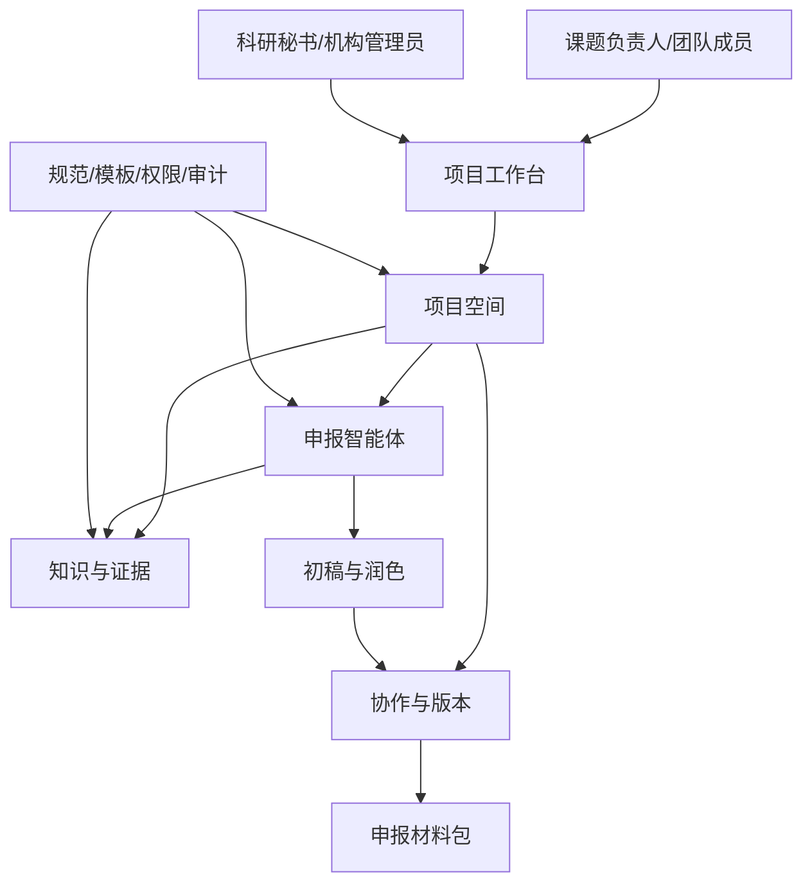
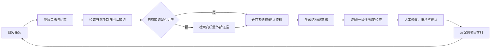

# 国家级课题申报智能体顶层开发计划

> **后续设计参考**：本文保留完整产品方案；本轮范围见[实施方案](08-本轮实施方案/01-范围与任务流程.md)，领取以[任务池](TEAM_DEVELOPMENT_TASKS.md)为准。A/B/C 仅指领域，不分配人员。完整 PCC、复杂权限等不自动成为本轮前置条件。

> 面向对象：实验室、课题组和人文社会科学研究团队。  
> 产品定位：面向国家级课题申报的**证据驱动型研究协作智能体**，以团队已有知识为首要工作基础，并通过高质量期刊/会议文献检索补全证据，协助构建申报逻辑、生成初稿并完成可追溯的润色与审校。  
> 阅读边界：本文只定义产品顶层设计、业务能力和验收方向；技术实现细节见 [技术实施附件](DEVELOPMENT_PLAN.md)，三人执行分工见 [团队执行清单](TEAM_DEVELOPMENT_TASKS.md)。

> **核心判断**
>
> 本产品不是“自动写标书”的生成器，而是让研究者在可靠证据、团队知识与人工决策之上更快完成高质量申报材料的协作工作台。研究问题、学术判断、事实确认和最终提交始终由人负责。

## 目录

- [1. 项目愿景与问题定义](#1-项目愿景与问题定义)
- [2. 目标用户与核心场景](#2-目标用户与核心场景)
- [3. 产品定位、边界与原则](#3-产品定位边界与原则)
- [4. 顶层产品架构](#4-顶层产品架构)
- [5. 智能体体系设计](#5-智能体体系设计)
- [6. 知识与证据治理](#6-知识与证据治理)
- [7. 模板与规则系统](#7-模板与规则系统)
- [8. 用户工作流与交付形态](#8-用户工作流与交付形态)
- [9. 分阶段产品范围](#9-分阶段产品范围)
- [10. 组织治理、质量与验收](#10-组织治理质量与验收)
- [11. 顶层决策与待确认事项](#11-顶层决策与待确认事项)

## 1. 项目愿景与问题定义

### 1.1 愿景

建立一个“研究团队的课题申报协作空间”：它将分散的文献、既有成果、政策/指南、访谈与调研材料、团队经验沉淀为可检索、可引用、可协作的项目知识；再由智能体协助将这些知识组织为研究问题、文献综述、研究框架、研究设计、创新点、进度与成果等申报内容。

### 1.2 要解决的真实问题

| 当前困难                            | 顶层解决方向                                    |
| ------------------------------- | ----------------------------------------- |
| 文献和既有成果分散在个人电脑、群聊、网盘与数据库，难以复用   | 建立以“项目工作区”为中心的团队知识空间，保留来源、权限和版本。          |
| 申报书往往从零开始，研究问题、文献综述、方法和创新点之间不一致 | 以“研究主张—证据—章节”链路组织写作，持续检查逻辑一致性。            |
| LLM 生成文字快但不可靠，容易出现无来源、错引和泛化表述   | 让每个关键结论可回溯到资料或人工确认；无证据时明确提示，而非补造。         |
| 实验室与人文社科团队协作方式不同，通用聊天工具难以承接     | 支持共同资料库、角色分工、任务/批注、版本比较与导出，不把研究过程压缩成单轮对话。 |
| 国家级申报规范、指南与模板会变化，人工核对成本高        | 将规范作为可更新的“申报要求清单”，辅助核查，不承诺替代正式审核。         |

### 1.3 北极星结果

对于一项课题，团队可以在同一工作区完成：**找资料 → 建证据 → 定问题 → 搭框架 → 共写初稿 → 校核润色 → 形成可提交材料包**；每一步都清楚“谁做了什么、依据是什么、还缺什么”。

## 2. 目标用户与核心场景

### 2.1 用户角色

| 角色 | 关注点 | 产品应交付的价值 |
|---|---|---|
| 首席专家/课题负责人 | 学术方向、申报质量、最终决策 | 快速掌握证据、审阅关键主张、把控结构与版本。 |
| 青年教师/研究骨干 | 文献梳理、章节撰写、研究设计 | 获得有来源的研究辅助、初稿和针对性的润色建议。 |
| 实验室管理员/科研秘书 | 材料归档、协作推进、规范检查 | 管理模板、团队知识、任务、版本、权限和导出。 |
| 学生/研究助理 | 资料收集、编码、整理与校对 | 按受限权限完成资料入库、摘录、标注与待办。 |
| 平台运营管理员 | 租户、使用、合规与支持 | 只看必要的聚合信息，进行账号、配额和审计治理。 |

### 2.2 首批必须覆盖的场景

1. **已有知识驱动的项目工作**：围绕团队已有论文、专著、结项材料、实验/调研记录、政策文本和历史申报经验进行问答、关联、归纳与写作，优先回答“团队已经知道什么、已经做过什么”。
2. **项目知识管理**：把上述材料归入工作区，并标记来源、主题、保密等级和可用范围，使其成为后续所有智能体任务的默认依据。
3. **高质量文献与政策指南检索**：仅当已有知识不足、需要核验或需要扩展研究脉络时，从机构授权的主流文献平台检索，优先返回符合期刊/会议质量要求的结果，并形成可验证的证据卡片。
4. **申报逻辑构建**：辅助形成选题依据、研究问题、理论视角、研究对象、方法、技术路线、创新点、预期成果和进度之间的一致框架。
5. **初稿协作**：基于经过选择的资料生成章节初稿、提纲、表格和摘要；团队可批注、改写、比较版本和分配待办。
6. **润色与审校**：检查表达、结构、术语一致性、重复、引用缺失和“主张是否有证据”；对格式/字数/模板要求做辅助核查。

### 2.3 人文社科与实验室的共同与差异

共同点是都需要证据、协作、版本和可追溯写作。差异应由工作区配置承接，而不是做两套产品：

- 人文社科工作区强调文献脉络、理论争鸣、文本材料、访谈/田野资料、政策语境和规范引文。
- 实验室工作区强调既有项目、数据/实验材料、研究基础、技术路线、可行性、成果与分工。
- 两类工作区都使用同一个“项目主张—证据—章节—任务—版本”模型，只是资料类型、评审清单和模板不同。

## 3. 产品定位、边界与原则

### 3.1 产品定位

产品是一个垂直研究协作智能体，而不是通用聊天机器人。它的最小对外 interface 是：用户给出研究任务，系统先基于当前项目的已授权知识回答或起草；只有在知识缺口需要补充/核验时才调用高质量学术检索；最终返回**带来源、带不确定性说明、可进入项目材料的建议或草稿**，并允许用户审阅、修改、确认或拒绝。

### 3.2 明确边界

| 产品做什么 | 产品不做什么 |
|---|---|
| 协助检索、整理、关联、摘要、比较和写作 | 不虚构文献、数据、引文、政策条款或研究结论。 |
| 生成供研究者编辑的初稿和改写建议 | 不代替课题负责人作学术判断、伦理判断或最终提交。 |
| 按可配置要求辅助检查结构/材料完整性 | 不承诺任何申报结果，也不宣称获得主管部门的自动认可。 |
| 管理团队知识和协作过程 | 不将私有资料用于其他租户，也不默认把原始资料用于模型训练。 |

### 3.3 产品原则

1. **证据优先**：关键主张必须可追溯到来源、团队确认或明确的“待核实”状态。
2. **研究者主导**：智能体提出候选方案，研究者拥有选择、修改、审批和发布权。
3. **项目而非对话中心**：对话只是入口，最终沉淀到项目结构、资料、任务、版本与材料包。
4. **协作可见**：任何自动生成、人工改写、审批和导出都有作者、时间、依据和版本。
5. **数据克制**：按最小权限管理资料；敏感、未公开和受限材料默认不跨工作区、不外发。
6. **领域可配置**：适配不同申报类型、学科、机构模板和评审关注点，核心工作流保持一致。

## 4. 顶层产品架构

### 4.1 四个面向用户的深模块

| 模块 | 用户只需理解的 interface | 模块内部要隐藏的复杂性 | 产出 |
|---|---|---|---|
| 项目空间 | 创建/加入一个课题，选择申报类型和成员角色 | 资料权限、任务、版本、模板、状态关联 | 一份可协作的项目全景。 |
| 知识与证据 | 导入、检索、标注、确认资料 | 文档处理、检索策略、去重、来源解析、保密控制 | 可复用的证据卡、资料库和知识图谱式关联。 |
| 申报智能体 | 选择任务并获得可审阅结果 | 多轮推理、资料选择、工具编排、质量检查 | 研究建议、结构、初稿、修改建议。 |
| 协作与材料包 | 批注、分配、比较、确认、导出 | 冲突处理、版本谱系、审批、格式映射 | 团队认可的申报材料及其依据。 |

### 4.2 平台治理能力

平台治理不应干扰研究者日常写作，但必须始终存在：身份与工作区权限、资料分类、使用量、审计、可配置申报要求、数据保留和机构级知识资产。RuoYi root 管理台属于这一层，只服务机构/平台治理，不进入普通研究者的写作路径。

## 5. 智能体体系设计

### 5.1 一个协作智能体，五种可感知能力

首期不向用户暴露复杂的多 Agent 编排。用户看到的是一个“课题申报助手”，它根据当前任务调用以下五种能力：

| 能力 | 解决的任务 | 输出必须满足 |
|---|---|---|
| 文献研究员 | 优先梳理团队已有成果；在知识缺口存在时，从经审核的主流文献平台检索、筛选、比较中外文献、政策/指南 | 给出来源、资料归属、期刊/会议质量标签、摘要、相关性与不确定项。 |
| 知识管家 | 导入、分类、去重、标注、关联和更新项目资料 | 保留来源、权限、版本和使用范围。 |
| 申报架构师 | 研究问题、框架、方法、创新点、可行性与章节关系 | 清楚区分事实、推断、备选方案与待确认问题。 |
| 写作协作者 | 大纲、章节初稿、摘要、表格、改写与语言润色 | 基于选定资料；新增主张标为待核实；可回到原段落。 |
| 审校助手 | 一致性、逻辑、引用、重复、字数与模板检查 | 输出问题清单和修改建议，不直接替代人工通过。 |

### 5.2 智能体工作方式

该循环的关键是“研究者确认资料”与“人工确认结果”两个节点：任何看似完整的文本都可以继续被质疑、补证或改写。系统应把缺口显式呈现为“待补文献”“待确认事实”“待负责人决策”，而不是用通用表述掩盖。

### 5.3 任务卡，而非自由提示词堆叠

所有高价值能力以任务卡呈现，让用户明确输入、输出和责任：

- 文献综述：主题、时间范围、语种、资料范围、输出框架。
- 研究问题与创新点：研究对象、已有认识、拟突破点、证据要求。
- 研究设计：方法、样本/材料、可行性、伦理与数据约束。
- 章节初稿：目标章节、参考资料、字数/语气、不可改动内容。
- 润色审校：目标文本、保留观点、检查维度、是否允许结构重排。

任务卡降低使用门槛，也为团队复用、质量评估和审计提供统一载体。

## 6. 知识与证据治理

> **知识使用优先级**
>
> **当前项目已确认知识 → 经授权的团队/机构知识 → 高质量外部学术文献 → 人工待核实线索。** 智能体在每一步应说明本次回答主要使用了哪一层知识；外部检索用于补全和交叉核验，不能冲淡团队已有研究基础。

### 6.1 项目知识的层次

| 层次 | 内容 | 用途 |
|---|---|---|
| 公共参考层 | 合法授权的文献、公开政策、公开指南、公开案例 | 支撑背景、现状和规范理解。 |
| 机构知识层 | 机构允许复用的成果、模板、结项经验、特色资料 | 支撑研究基础与组织能力。 |
| 团队项目层 | 当前课题的资料、笔记、调研、讨论、草稿和决策 | 是申报协作的核心，不默认跨项目复用。 |
| 个人工作层 | 个人暂存资料、私有笔记、未公开想法 | 默认仅本人可见，主动加入项目后才共享。 |

### 6.2 证据卡是最小可信单元

每条将被用于申报材料的重要资料，都应以证据卡形式沉淀：来源/作者/时间、原文位置、摘要、适用的研究主张、可信度或待核实状态、使用权限、被哪些章节引用。这样“文献管理”和“写作生成”共享同一份事实基础。

### 6.3 数据与学术伦理

- 未公开论文、访谈、田野材料、实验数据和个人信息按更高等级管理；用户必须能决定是否进入项目知识空间。
- 引文、文献元数据和政策文件的合法获取、使用与导出由机构规则配置；系统保留来源，不能把受限全文当作无条件共享内容。
- 智能体对可能涉及个人信息、敏感政治/社会议题、伦理审批或数据出境的任务提示风险，并要求研究者确认处理方式。

### 6.4 受控学术网页检索

学术网页检索是知识与证据模块的重要补充，定位为“**高质量来源发现与核验**”，不是面向任意互联网内容的通用搜索。它在项目已有知识不足、研究者主动要求扩展文献或需要交叉核验时启用。

| 规则 | 顶层要求 |
|---|---|
| 来源接入 | 对接机构已授权、平台允许的主流中英文文献平台及其公开/授权检索 interface；接入前明确许可、可返回字段、访问限额和引用规则。 |
| 质量白名单 | 按机构配置的学科目录、期刊/会议分级、收录范围、年份、语种和同行评审状态筛选；只把符合当前项目规则的结果作为“推荐证据”。 |
| 结果呈现 | 每条结果展示来源平台、作者、年份、期刊/会议、摘要/可用链接、质量标签与检索时间；不能获取全文时明确标为“仅元数据/摘要”。 |
| 使用边界 | 不绕过订阅、付费墙、robots 或平台条款；只使用用户/机构被授权访问的内容；全文下载、批量导出和再分发需要单独授权。 |
| 可追溯性 | 进入项目知识空间的外部文献保留检索式、筛选条件、原始链接、引文元数据和导入时间，支持复核与更新。 |
| 失败处理 | 没有高质量命中时提示扩大/修改检索式或人工补充，不以普通网页、博客、营销内容替代学术证据。 |

> **质量不是固定名单**
>
> “高质量期刊/会议”必须由机构和学科负责人配置并可版本化，例如按本机构认可目录、数据库收录、同行评审状态和学科规则组合判断。产品负责执行规则与展示依据，不应将任何静态平台名单或单一指标当作跨学科的绝对标准。

## 7. 模板与规则系统

申报材料"是否合规"这件事，不能只靠专家人工核对，也不该只做成格式工具。本产品把它拆成三层，由不同主体负责——**这是"审校助手不直接替代人工通过"在产品架构上的落地方式**。

### 7.1 模板是代码与 AI 的共用合同

模板（申报结构模板）不只是章节清单，它一次性定死四件事：**章节结构、必要字段、可计算规则、适用范围与版本**。前两者决定用户看到什么、填什么；后两者决定什么算缺漏、什么能放行。

关键约束是：**模板不是给 AI 的提示词，而是代码与 AI 的共用合同**。规则不能寄居在提示词里——同一份内容、同一套规则，必须算出同一个结论，否则"导出放行"失去依据，审计也答不出当时为什么放它过。

### 7.2 三类判断，三个归属

| 判断类型 | 归属 | 例子 | 出错怎么办 |
|---|---|---|---|
| 结构、字段、字数、标题层级、可计算格式 | **规则（代码）** | 缺必要字段、字数超限 | 修规则，重跑即修正 |
| 术语一致性、论断是否有支撑、论证是否呼应 | **模型（AI）** | 术语前后不一、某主张只有背景线索 | 人推翻，不改代码 |
| 例外是否可接受、学术价值是否成立 | **人工** | 接受一条警告、判定误报 | 人担责，记录理由 |

**分界线是"能否复算"，不是"难不难"**。这只是否能保证相同输入得到相同输出，能则下沉到规则；依赖语义理解则留在模型层，并接受被推翻。

一个直接的产品体现：**格式类问题可提供一键修复预览，论证与证据类问题只能给出建议**——因为"术语不一致往哪边统一"是研究决策，不是排版决策。

### 7.3 同一套规则，两次求值

| 求值 | 对象 | 时机 | 结果去向 |
|---|---|---|---|
| 写作期检查 | 项目当前内容 | 写作过程中随时 | 只落在界面，不改变交付状态 |
| 导出前检查 | 冻结的交付快照 | 内容或模板变化时 | 交付放行的唯一依据 |

只有导出前检查，缺口会拖到交付前才暴露；只有写作期检查，答不出"这一个快照到底能不能导"。两者共用同一套规则、严重度和处置方式。

### 7.4 模型判断与规则判断同等可推翻

规则问题和模型问题进入**同一个问题清单**，走同一套处置。两条边界必须守住：

- **误报删除**（判定"这条问题本不该存在"）对**任一严重度开放，含阻断级**——模型和规则都会判错，用户必须能推翻它；
- **豁免**（承认问题真实存在、本次接受）**只对警告与提示级开放，阻断级不可豁免**。

删除绑定"规则 + 目标对象 + 对象版本"，因此**不得成为永久静音**：目标对象产生新版本后，问题在下次检查中重新出现。

### 7.5 演进约束

| 事项 | 约束 |
|---|---|
| 模板升级 | 已确认正文**不自动改写**；既有快照的检查结论失效 |
| 换模板 | 同名字段按名保留，原模板独有字段标"模板不再需要"，缺失字段标"待填"——**不得清空已填内容** |
| 新增规则 | 需有可复现样例与误报评估；阻断级规则的误报会让整个团队停摆，宁可先设为警告级 |
| 治理边界 | 规则的领域定义与实现归交付侧；机构管理台负责发布、审阅、撤销，**不直接写规则内容** |

> **与智能体设计的关系**
>
> 第 5.1 节把"审校助手"列为五种能力之一，其输出必须满足"问题清单和修改建议，不直接替代人工通过"。本节说明这件事在系统上如何成立：**AI 参与判断，但交付契约不依赖 AI 的表现**。
>
> 详细的规则结构、求值契约与问题实体设计见 [模板与规则系统设计](06-灵档产品开发规划/11-模板与规则系统设计.md)。

## 8. 用户工作流与交付形态

### 8.1 从选题到材料包

| 步骤 | 用户动作 | 系统协助 | 可交付物 |
|---|---|---|---|
| 1. 建项 | 创建项目、选择申报类型/模板、邀请成员 | 生成项目清单和资料目录 | 项目首页、角色与待办。 |
| 2. 资料建库 | 优先导入成果、既有项目、文献、指南和调研材料；必要时发起高质量文献检索 | 先建立项目知识索引；知识不足时受控连接平台、按质量规则筛选、形成证据卡候选 | 结构化项目资料库。 |
| 3. 研究定位 | 输入选题构想与约束 | 文献脉络、研究空白、问题树、待证假设 | 已确认的研究主张与问题框架。 |
| 4. 方案设计 | 明确对象、方法、基础、预期成果 | 提供可比较的结构方案与缺口清单 | 研究框架、技术/研究路线、任务分工。 |
| 5. 撰写初稿 | 选择章节任务和资料范围 | 生成可回溯初稿与引用建议 | 可编辑章节草稿。 |
| 6. 团队审阅 | 批注、修改、分派问题、确认版本 | 汇总分歧、检查一致性、列出未闭环问题 | 经团队确认的版本。 |
| 7. 定稿导出 | 选择机构模板与材料清单 | 格式/完整性辅助检查、导出前审校 | 申报书、附件清单、证据与版本记录。 |

### 8.2 面向用户的产品形态

- **Web 工作台（核心）**：项目首页、对话/任务卡、资料库、章节编辑器、审阅区、材料包与团队管理。
- **机构管理台**：账号、工作区、模板、使用量、审计和支持；与研究工作台物理/权限隔离。
- **开放接入（后续）**：面向机构系统的项目、资料和状态接入；对外接入以项目权限和审计为前提，而非开放原始知识库。
- **移动使用（后续）**：优先处理查看进度、批注、审批和通知，不把复杂写作编辑作为首要移动场景。

## 9. 分阶段产品范围

### 阶段一：可信知识与辅助写作闭环

目标是让一个课题组完成“资料入库—检索—引用式问答—章节初稿—人工修改”的最小闭环。

**交付范围**：项目工作区、角色权限、资料导入、证据卡、以团队已有知识为主的问答与写作、机构授权的高质量文献检索补充、带引用对话、任务卡初稿、基本版本与批注、基础审计。

**验收标准**：团队可用真实或脱敏的代表性资料建立项目库；每个关键回答能说明依据或明确无依据；成员可在同一章节完成生成、修改、评论和确认；其他项目/租户不可见。

### 阶段二：完整申报协作与可控 Agent

目标是让团队围绕完整申报书协作，并让智能体在明确权限下完成多步骤任务。

**交付范围**：申报结构模板与规则系统（写作期检查、导出前检查、统一问题清单与两种处置语义）、研究框架/创新点/研究设计任务卡、章节一致性检查、团队任务流、版本比较、审批、可恢复的长任务、机构管理台、用量与审计看板。

**验收标准**：团队能从选题到材料包完成一条完整流程；高风险外部操作均需确认；浏览器断线或工作任务中断后可恢复并说明状态；管理员能审计而不需要接触底层数据存储。

### 阶段三：机构知识资产与领域扩展

目标是从单课题工具发展为机构可持续复用的研究协作平台。

**交付范围**：经授权的机构知识复用、模板/任务卡市场、学科包、外部系统接入、批量评测、机构级知识治理、移动审批与通知。

**验收标准**：至少两类学科/团队可以通过配置使用同一核心流程；机构可控制哪些知识可复用；新模板和任务卡可在不改变核心产品行为的情况下发布、审阅和撤销。

## 10. 组织治理、质量与验收

### 10.1 产品质量的四条红线

| 红线 | 可观察标准 |
|---|---|
| 不伪造 | 对引用、数据、政策、成果等不可验证信息，系统标为未知/待核实。 |
| 不越权 | 任意成员、项目或机构之间的资料和对话均按权限隔离。 |
| 不失控 | 有副作用的智能体动作可理解、可拒绝、可取消、可审计。 |
| 不失去研究者 | 最终文本、关键研究主张和材料导出均有明确的人类责任人。 |

### 10.2 上线前必须用真实场景验收

选择至少三类试点课题：一个人文社科文本研究、一个社会调研/应用研究、一个实验室/交叉研究项目。每类由真实课题组完成一段端到端流程，并评估：

1. 资料是否找得到、用得对、来源是否清楚；
2. 初稿是否真正减少整理时间，而非增加核对负担；
3. 研究问题、文献、方法、创新点和预期成果是否保持一致；
4. 团队协作、权限和版本是否满足负责人/秘书的工作方式；
5. 哪些建议必须由人工修正，并将问题反馈为任务卡/评测集改进项。

### 10.3 运营治理

建立“研究者反馈—产品改进—模板/任务卡更新—质量复测”的闭环。对机构模板、规范清单和学科任务卡设内容负责人、审核人、版本及废止机制；对模型回答、工具调用和资料访问保留最小必要审计，但不将研究原文扩大暴露给运营人员。

检查规则的演进需单独设门槛：新增或收紧一条规则要有可复现样例、明确判定方（可复算归规则、语义归模型）和误报评估。**阻断级规则的误报会让整个团队停摆**，因此模型类检查项默认从警告级起步，达到误报评估门槛后再考虑升级为阻断。具体设计见 [模板与规则系统设计](06-灵档产品开发规划/11-模板与规则系统设计.md)。

## 11. 顶层决策与待确认事项

### 11.1 已建议确定的方向

- 以 WeKnora 已有知识库、检索、会话、Agent 和权限能力作为底座；产品价值来自课题申报工作流与证据治理，而不是重复建设通用 RAG。
- 已有知识是智能体的第一工作对象：先帮助团队继承和运用研究基础，再以高质量外部文献补齐空白、核验论据和扩展脉络。
- 以“项目空间”作为所有资料、任务、Agent 产出和协作的主线；不以“聊天记录”作为最终知识载体。
- 以“一个协作智能体、五种可感知能力”对外呈现；内部复杂性不成为首期用户学习成本。
- RuoYi 只承担机构/root 治理，普通用户不需要在两个后台之间完成研究工作。

### 11.2 立项前需由团队/机构确认的事项

- 首批服务的课题类型、学科范围和机构模板来源；哪些材料可由系统检查、哪些只能提示人工核对。
- 文献与政策资料的授权来源、可访问范围、期刊/会议质量目录、引用规范与外部检索边界。
- 试点实验室/课题组、他们的真实协作方式、保密等级和可提供的脱敏样本。
- 企业身份体系、数据存储地域、数据保留/删除规则，以及个人信息和敏感资料处理要求。
- 对“初稿可用”的共同标准：是节省资料整理时间、提高结构一致性，还是达到某类负责人可接受的起草质量；必须可测量。

> **与相关文档的关系**
>
> 本文是产品主计划：用于对齐目标、范围、用户价值与验收。[技术实施附件](DEVELOPMENT_PLAN.md) 说明如何让这些能力在生产环境可靠运行；[团队执行清单](TEAM_DEVELOPMENT_TASKS.md) 再把实施附件拆成三人的可领取工作项；[模板与规则系统设计](06-灵档产品开发规划/11-模板与规则系统设计.md) 展开第 7 节的系统契约。后三者不应反过来决定产品范围。
